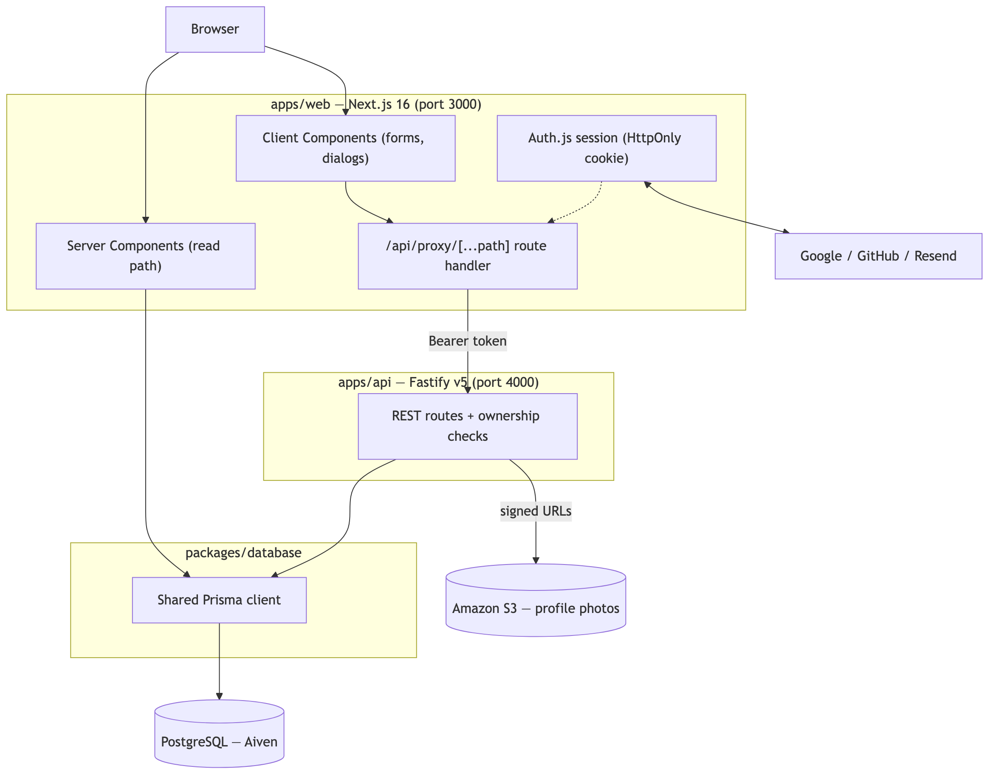
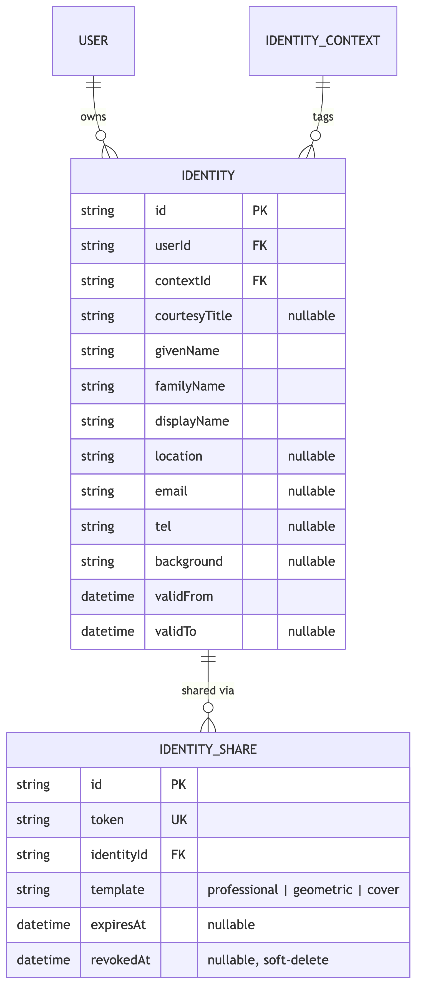
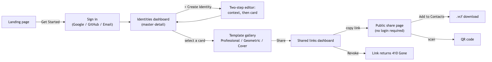
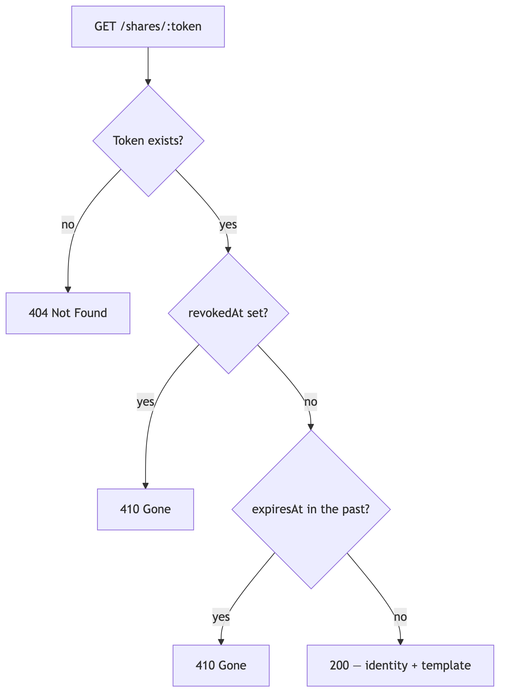

# CM3070 Final Project Report
## ContextID: A Context-Aware Digital Identity Management System

**Student:** Zhe Wang

**Date:** August 2026

**Project Template:** 7 CM3035 Advanced Web Design, 7.1 Project Idea 1 — *Identity and profile management API*

---

# Chapter 1: Introduction

## 1.1 Motivation and Problem Statement

People hold many roles at once: a software engineer, a musician, a parent, a graduate of a particular university. In ordinary life this plurality is unremarkable — a person presents differently at a conference than at a family dinner, without needing to reconcile the two. Online, few platforms preserve that separation. LinkedIn places work history and education on a single page; a personal social feed mixes colleagues and family; a single email address quietly links accounts a person may have preferred to keep apart. The academic literature has a name for the resulting failure mode — *context collapse*, the flattening of previously distinct audiences into one undifferentiated space (Marwick and boyd, 2011) — and it is a useful frame for the rest of this report, because it treats the problem as a structural property of platform design rather than a matter of individual carelessness.

The consequences are concrete. Someone at a conference may want to share contact details without disclosing a personal phone number. A person with both a Chinese and an English name may find that a single "full name" field cannot represent either correctly. Someone who shares a phone number with a new contact may later want to limit or withdraw that access, only to discover that most systems provide no mechanism to do so once information has left their control. These are not edge cases; they are ordinary experiences for anyone who moves between social or professional groups. Existing tools — LinkedIn, digital business-card applications, link-in-bio pages — each address a fragment of the problem, but none combine separate contexts, fine-grained sharing control, and genuine revocability in one system aimed at non-technical users.

## 1.2 Project Concept

ContextID is a web-based identity management platform built on a simple premise: one user account may hold several identity cards, each scoped to a context such as Professional, Academic, Personal, Family, or a user-defined label. Each card carries its own structured name — given name, family name, and optional additional given and secondary family name components — so that naming conventions outside the Western first/last pattern can be represented correctly rather than forced into it. A card may also carry a display name, courtesy title, email, phone number, location, short description, photograph, and a validity period, so that an affiliation can expire naturally instead of remaining visible after it has ceased to apply.

The system's central feature is sharing by link rather than by copy. The owner selects a visual template and generates a unique URL for a specific card; the recipient opens that link and sees a clean, unauthenticated public page. The owner can revoke the link at any time from a dashboard listing every link created, active or not, giving them ongoing control over each disclosure rather than a single irreversible act of sharing a complete profile.

The system targets people with no particular technical background. Creating an identity is a short guided flow: choose a context, then edit the card directly while it already looks the way a recipient will see it. Sharing takes one click and copies the link automatically. There is no password to remember — sign-in is by Google, GitHub, or a one-time email link.

## 1.3 Project Template

This project is based on Project Template 7, CM3035 Advanced Web Design, Project Idea 7.1 — Identity and profile management API. The brief asks for a web application built around a REST API, where users can manage their identity and profile information and have control over what information they share with other people. ContextID follows this idea by providing a full-stack application with a Fastify REST API, a PostgreSQL database using Prisma, and a Next.js client that communicates with the API. The project also covers the deployment process and requirements analysis.
## 1.4 Technical Approach

The system is a TypeScript monorepo managed with Turborepo and pnpm: a Next.js 16 frontend using the App Router, and a Fastify v5 REST API, both reading and writing through a single Prisma schema and client against a shared PostgreSQL database. Profile photographs are stored in Amazon S3. Authentication is handled by Auth.js v5, supporting Google OAuth, GitHub OAuth, and passwordless email sign-in through Resend, with sessions persisted server-side in the database rather than trusted from a signed cookie alone.

Deployment is automated with GitHub Actions and Terraform: pushing a version tag builds and pushes Docker images for both applications to Amazon ECR, applies pending database migrations, and deploys to AWS ECS behind a resolved custom domain, using GitHub's OIDC federation so that no long-lived AWS credentials are stored in the repository.

## 1.5 Target Users and Value Proposition

ContextID is designed for professionals, academics, multilingual users, and anyone who often shares their contact information but does not want everyone to have the same full and permanent profile. The main idea is to give users more control over what they share. They can choose what information to show, how the profile looks, and how long it stays available, and they can change these settings later. A printed business card is usually a one-time action that cannot be changed or taken back. With ContextID, the owner keeps control of their digital card for as long as they want, while recipients can still save the information to their contacts or scan a QR code.

## 1.6 Report Structure

Chapter 2 extends the literature review, in response to feedback that it lacked depth, with self-sovereign identity and usable security as further contrasts. Chapter 3 revises the design chapter to add the architecture, data-model, and interface diagrams the same feedback identified as missing, plus a risk-and-contingency assessment. Chapter 4 describes the implementation, including work completed since the draft — a design-system migration, input-validation hardening, contact export, and authentication-flow fixes. Chapter 5 evaluates critically: a security vulnerability found and fixed, the partial state of automated testing, and unresolved gaps in usability and accessibility evidence. Chapter 6 concludes with prioritised future work.

---

# Chapter 2: Literature Review

This chapter revises and extends the literature review from the draft report. The preliminary submission was assessed as having a limited review; the response taken here is not only to add citation density but to use each source to make a specific, checkable claim about ContextID's design, including where the system falls short of what the source would recommend, rather than treating the literature as background colour for a design already fixed.

## 2.1 Context Collapse and Contextual Integrity

Nissenbaum’s (2004) theory of contextual integrity gives a clearer way to understand this problem. She argues that privacy is not simply about keeping information secret or controlling data. Instead, it depends on whether information is shared in a way that fits the situation where it was originally given. For example, sharing your job information at a conference and showing the same information on a dating profile uses the same data, but the two situations have very different expectations. Privacy can therefore be broken even when someone has permission to access the information, if the information is being shared in an inappropriate context. This is one of the main reasons for ContextID’s design, where users create separate identity cards for different contexts instead of having one profile and adding visibility settings afterward.

It is also important to explain what this design cannot prevent. Nissenbaum’s theory focuses on whether information is shared appropriately within a context. It does not cover what someone does with the information after they receive it. ContextID’s features, such as hard-to-guess links, revocation, and expiry, cannot stop someone from sharing a card outside its intended context. Revoking a link prevents future access through that link, but it cannot remove a screenshot or a copy that someone has already made. This is a real limitation of the system, rather than a problem that has been completely solved, and it is discussed again in the evaluation in Chapter 5.

## 2.2 Personal Names Are More Structured Than Software Assumes

Most software stores a name as two fields, first and last. Ishida's (2011) W3C Internationalization guidance documents at length how poorly this generalises: in China, Japan, Korea, and Hungary the family name conventionally precedes the given name; Spanish and Portuguese names typically carry two family names, one from each parent; Icelandic names have no family name in the Western sense at all; and automated parsing of a three-token name cannot reliably determine, without cultural context, whether it represents two given names and one family name or the reverse. Ishida's methodological point — that name fields should be designed around what a form needs to *display and address a person correctly*, not around a fixed Western template — is the one ContextID adopts directly, storing given name, family name, and optional additional given and secondary family name components separately, alongside a distinct, freely editable display name per identity.

This separation matters beyond formatting. ISO/IEC 24760-1:2019, the identity-management terminology standard, defines an identity as a set of attributes related to an entity *within a particular context*, explicitly permitting the same entity to hold multiple, simultaneously valid identities. Read alongside Ishida, this supports treating the display name as a first-class, context-specific attribute rather than a derived string: a legal name is comparatively invariant, but the name a person wishes to be *addressed by* is not, and conflating the two — as most systems do — is itself a design error rather than an internationalisation gap.

## 2.3 Digital Identity Theory: Cameron's Laws of Identity

Cameron's (2005) *Laws of Identity*, written while he was Microsoft's Chief Identity Architect, remains one of the clearest attempts to state what a trustworthy digital identity system should do. Two of the seven laws bear directly on ContextID and are worth measuring the system against rather than simply citing.

The Law of Minimal Disclosure states that a system should reveal the smallest amount of identifying information a purpose requires, and for no longer than necessary. ContextID only partly satisfies this. A share link is scoped to one identity card rather than a user's entire account, a real improvement over a single monolithic profile, but the card itself is shared as one indivisible unit: a recipient who needs only an email address also receives the phone number, location, and description, because ContextID does not yet support disclosing individual fields separately. This is flagged as an explicit, unresolved gap and is the top functional item in the future-work list in Chapter 6.

The Law of Directed Identity distinguishes *omnidirectional* identifiers — public and easily discoverable, such as a company's DNS name — from *unidirectional* identifiers, intended for one specific relying party and not meant to be linkable across contexts. ContextID's share tokens function as unidirectional identifiers: each is generated independently per recipient and is not derived from the identity's own database identifier, so two recipients holding different links to the same card cannot use the tokens themselves to infer they refer to the same person. This is a genuine, if partial, alignment with Cameron's model, and gives stronger privacy than most consumer sharing tools, which typically expose a single stable public profile URL to every visitor.

## 2.4 Self-Sovereign Identity: A Contrasting Paradigm

A different research tradition — self-sovereign identity (SSI) — rejects the server-mediated model ContextID adopts, and is worth engaging with directly because it represents the strongest alternative design philosophy available, not merely a related idea. Allen's (2016) widely cited formulation of SSI principles argues that identity should be held and controlled by the individual, portable across services, and independent of any single administrative authority, typically realised through decentralised identifiers and cryptographically signed, holder-presented credentials. The W3C's Verifiable Credentials Data Model (W3C, 2022) formalises this as a three-party model — issuer, holder, verifier — in which a credential, once issued and cryptographically signed, can be verified offline by any party without contacting the issuer at presentation time.

This is a direct and instructive contrast with ContextID's approach. ContextID is deliberately centralised and *online-verified*: a recipient's browser must contact ContextID's server on every visit to a share link, because that is precisely the mechanism that makes revocation possible. A self-issued verifiable credential, once presented and its signature checked, cannot be revoked in the same immediate sense unless the verifier separately checks a revocation list at presentation time — an obligation the SSI model places on the verifier, not the holder, and one that is frequently omitted in practice. ContextID trades the SSI model's portability and offline verifiability for a property SSI does not straightforwardly offer: an owner-initiated "off switch" that a recipient's client cannot silently ignore. Neither design is strictly superior; they optimise for different threat models, and ContextID's choice should be read as a deliberate one rather than an unawareness of the alternative.

## 2.5 Prior Art and the Gap

Several existing tools address fragments of the same problem. LinkedIn presents a single professional identity with no mechanism for showing a different profile to different viewers. Virtual business-card applications such as HiHello and Blinq support link-based sharing but, in their free tiers, offer only one card per account and no link-level revocation once a card has been sent. Link-in-bio tools such as Linktree and About.me aggregate a single public identity rather than supporting multiple, separately controlled ones. None of the four combine multiple context-scoped identities, individually revocable and expirable share links, structured non-Western name fields, and zero-account access for the recipient.

| Tool | Multiple contexts | Access control | Link revocation | No recipient account | Structured names |
|---|:---:|:---:|:---:|:---:|:---:|
| LinkedIn | No | Coarse | No | No | No |
| HiHello / Blinq | Partial | No | No | Yes | No |
| About.me / Linktree | No | No | No | Yes | No |
| **ContextID** | **Yes** | **Yes** | **Yes** | **Yes** | **Yes** |

This table should not be read as ContextID being unambiguously superior — each competitor optimises for something ContextID does not attempt, such as Linktree's aggregation of many external links on one page, or LinkedIn's network effects. The narrower and more defensible claim is that none of them are built around Nissenbaum's flow-appropriateness principle as a first-class design constraint, and ContextID is.

## 2.6 Privacy Regulation and Privacy by Design

The GDPR (Regulation (EU) 2016/679) grants a right to erasure (Article 17) and requires privacy to be considered by design and by default (Article 25). Cavoukian's (2009) earlier Privacy by Design framework argued for exactly this: that privacy should be built into a system's architecture rather than bolted on as policy afterward. ContextID's revocation mechanism follows this principle structurally — a share is revoked by setting a `revokedAt` timestamp that the resolution endpoint checks on every request, so the capacity to withdraw access exists from the moment a share is created, not as a manually operated exception process.

This claim needs the same qualification given in §2.1: revocation invalidates the *token*, not the information a recipient has already viewed, copied, or memorised. Both contextual integrity and the GDPR's erasure right describe an ideal of complete withdrawal that no link-based sharing system, this one included, can fully deliver once data has left the system. ContextID's genuine contribution is making the technical act of withdrawal immediate and free of charge — a real improvement over an emailed vCard or a printed card, neither of which can be revoked at all — without overstating what that improvement achieves.

## 2.7 REST APIs for Identity Management

Fielding's (2000) dissertation introduced Representational State Transfer as an architectural style built around addressable resources, a small uniform set of methods, and requests that are self-contained rather than dependent on server-side session state. This fits an identity system well: identities, contexts, and shares are naturally distinct resources with their own URLs and lifecycles, and statelessness lets an unauthenticated recipient open a public share link without any prior interaction with the system. HTTP content negotiation (MDN, 2024), via headers such as `Accept-Language`, could in principle let a REST identity API return a name in a specific script or language where more than one representation exists; ContextID does not yet implement this, and it remains future work (Chapter 6).

## 2.8 Usable Security and the Limits of Technical Controls

A recurring theme of this chapter is that a technically correct control is not automatically an effective one if it is not legible to the person relying on it. Whitten and Tygar's (1999) classic usability evaluation of PGP 5.0 found that participants with genuine technical competence still failed, at alarming rates, to use a cryptographically sound tool correctly, because the interface did not make the security model comprehensible at the moment a decision had to be made. The lesson generalises beyond encryption: a revocation feature that exists in the API but is hard to find, or a destructive action whose confirmation is easy to dismiss without reading, provides less real protection than its technical correctness would suggest. This motivates treating interface clarity around consequential actions — discussed concretely in the usability evaluation in §5.5 — as a security-adjacent property of the system, not merely a cosmetic one.

## 2.9 Web API Security

A system that stores personal information and deliberately exposes part of it publicly must treat access control as a design property, not an implementation detail. The OWASP Application Security Verification Standard (OWASP, 2021) recommends at least 64 bits of entropy for security-sensitive tokens such as session identifiers and password-reset links, since shorter tokens become guessable at scale, and requires authorisation to be re-checked on every request that changes data, against the specific resource being changed. This addresses what OWASP's API Security Top 10 (OWASP, 2023) lists as the most common API security risk: broken object-level authorisation.

ContextID's share tokens use nine bytes of cryptographically secure randomness, giving 72 bits of entropy and exceeding the 64-bit baseline. The second requirement — authorisation checked per resource, per request — proved harder to satisfy consistently, as Chapter 5 describes in detail: a real gap existed and was found and fixed during evaluation. This illustrates precisely why OWASP frames the check as an ongoing discipline rather than a one-time design decision — it is straightforward to implement correctly in one route file and unintentionally omit from another as an API grows.

## 2.10 Authentication and Session Management

Cameron's Law of Minimal Disclosure (§2.3) extends naturally to authentication itself: a system should not require a credential it does not need to operate securely. ContextID uses OAuth's authorisation-code flow for Google and GitHub sign-in and a single-use, time-limited email link for passwordless sign-in, so the application never receives, stores, or is capable of leaking a password, because none is ever created — consistent with the wider move, driven substantially by the prevalence of credential-stuffing attacks against reused passwords, away from long-lived shared secrets and toward delegated or possession-based authentication. Sessions are stored server-side and re-validated against the database on every request rather than trusted purely from a signed token's claims, which bounds the usable lifetime of a stolen session token independently of whether the token itself is cryptographically compromised.

## 2.11 Synthesis

Across sources that use different vocabularies, this review converges on one principle: information should be shared only as widely, for as long, and with as many people as its context genuinely requires. Nissenbaum (2004) calls this appropriate flow; Cameron (2005) calls it minimal disclosure; the GDPR frames it as data minimisation and erasure; Whitten and Tygar (1999) add the condition that a control only counts if people can actually use it correctly. Self-sovereign identity (§2.4) shows that even this principle admits more than one architecture: ContextID's centralised, revocable model and the SSI holder-controlled model both aim at user control over disclosure, but trade off portability against immediacy of revocation in opposite directions.

None of the consumer tools surveyed in §2.5 pursues this principle system-wide. ContextID builds it in at the data-model level — separate identities per context, independently revocable shares, unlinkable per-recipient tokens — rather than adding it later as configuration. The review is equally clear about the limits of this approach: ContextID cannot un-share information a recipient has already seen or copied, cannot yet disclose a card at field granularity, and its revocation control is only as effective as the interface that presents it — a claim tested directly in the usability evaluation of Chapter 5.

---

# Chapter 3: Design

This chapter adds the architecture, data-model, and interface diagrams that feedback on the preliminary submission identified as missing, and closes with the risk-and-contingency assessment the same feedback requested.

## 3.1 Requirements

### Functional Requirements

| ID | Requirement |
|---|---|
| FR1 | A user can register and sign in using Google OAuth, GitHub OAuth, or an email magic link |
| FR2 | A user can create an identity card assigned to a named context |
| FR3 | System-provided contexts (Personal, Work, Family, Social) are pre-seeded and available to all users |
| FR4 | A user can create custom contexts in addition to system contexts |
| FR5 | Each identity stores an optional courtesy title, given name, family name, optional additional given name, optional secondary family name, display name, optional email, phone number, location, description, and a validity date range |
| FR6 | A user can upload a profile photograph per identity; a deterministic placeholder is shown otherwise |
| FR7 | A user can preview an identity in every available visual template before sharing it |
| FR8 | A user can generate a share link for any identity in any one template, with an optional expiry date |
| FR9 | A share link is revocable by the owner at any time and preserves an audit record after revocation |
| FR10 | An expired or revoked share link returns a distinguishable error (410 Gone) to the viewer |
| FR11 | The public share page renders the identity using the template selected at share time, and is accessible without authentication |
| FR12 | A user can update any field of an existing identity |
| FR13 | A user can delete an identity and all its associated shares |
| FR14 | No user can read, modify, share, or delete another user's identity, context, or share record through any API route |
| FR15 | A recipient of a shared identity can save it directly to their device's contacts (vCard) or open it by scanning a QR code, without needing an account |
| FR16 | Every field with a length limit is enforced identically on the client and the server, so a request that bypasses the UI cannot store data the UI would have rejected |

FR14 remains stated explicitly, in response to the ownership-check gap fixed during the evaluation in Chapter 5; it was previously only an implicit, unguaranteed consequence of FR1. FR15 and FR16 are new, reflecting functional additions made since the draft report.

### Non-Functional Requirements

**Security:** every operation on a specific resource requires the resource's owner to match the authenticated caller (FR14). Share tokens carry at least the OWASP-recommended 64 bits of entropy. Uploaded images are validated for MIME type and size.

**Internationalisation:** name fields accommodate non-Latin naming structures, including compound family names and multiple given names (§2.2).

**Usability:** editing shows a live, direct-manipulation preview rather than a disconnected form, and no master–detail view is left silently empty when data exists (§3.4).

**Accessibility:** pages target WCAG 2.1 AA. As Chapter 5 reports honestly, this is not yet verified by audit; §3.4 and §5.6 discuss a structural mitigation adopted meanwhile.

## 3.2 System Architecture

ContextID is a pnpm monorepo managed by Turborepo:

```
CM3070-FINAL-PROJECT/
├── apps/
│   ├── web/          Next.js 16 (App Router) — port 3000
│   └── api/          Fastify v5 REST API — port 4000
└── packages/
    └── database/     Prisma schema, migrations, seed, shared Prisma client
```

Figure 1 shows which component talks to which. Server Components read from PostgreSQL directly through the shared Prisma client, avoiding a network hop; client-side mutations go through a same-origin proxy route handler (`/api/proxy/[...path]`) that reads the `HttpOnly` Auth.js session cookie server-side and re-issues the request to Fastify with the session token as a `Bearer` header. This keeps the token out of reach of browser JavaScript and lets the API enforce authentication and ownership independently of the calling client — relevant directly to the security analysis in Chapter 5.


*Figure 1 — System architecture: read and write paths, and the trust boundary between the browser and the session token.*

## 3.3 Data Model

The domain schema has five core tables, extended since the preliminary report with fields the card needed to read as complete rather than a bare name:

- **User** — account record, managed by Auth.js
- **IdentityContext** — named context, nullable `userId` (null for system contexts). A unique constraint on `(userId, name)` prevents duplicate custom context names per user
- **Identity** — the identity card, including structured name fields, image, email, description, validity range, courtesy title, location, and phone. A unique constraint on `(userId, contextId)` enforces one identity per context per user
- **IdentityShare** — the share record, carrying both *which* identity is shared and *which visual template* it should render in, decoupling the owner's presentation choice from any single recipient's view
- **Account / Session / Authenticator / VerificationToken** — Auth.js adapter tables


*Figure 2 — Entity-relationship diagram of the core domain schema.*

## 3.4 Interface and Navigation Design

Figure 3 sets out the intended path through the interface. Two properties are deliberate rather than incidental: the recipient-facing path (from the public share page onward) requires no account or prior state, consistent with the stateless, resource-oriented design in §2.7; and the owner-facing path treats the identity card itself as the primary editing surface (§3.5), not a separate form.


*Figure 3 — End-to-end interface and navigation flow, owner and recipient paths.*

One usability consequence of this flow is addressed directly: on first arrival at either dashboard, nothing was selected and the detail panel was simply empty — a dead end, not an invitation to explore. Both views now default the panel to the first item on the current page when nothing is explicitly selected, so a blank pane is never shown when data exists — a small change motivated by heuristic evaluation (§5.5) and consistent with Nielsen's *recognition rather than recall* principle.

## 3.5 Key Design Decisions

**Direct-manipulation identity editing.** The prototype's three-step wizard (context, plain name form, separate preview) is collapsed to two steps: choose a context, then edit the card itself directly. Every recipient-visible field is entered on the live rendered card; legal name fields, which exist for correctness rather than presentation, sit in a plainer section beneath it — directly serving the usability requirement in §3.1 that a user should never have to imagine what they are creating.

**Per-share template selection.** Three visually distinct templates — Professional, Geometric, and Cover — are chosen at share time and stored on the `IdentityShare` record, not the identity. Cover also supports a curated background image, owner-chosen or defaulted deterministically per identity so a card never looks unfinished. The same identity can thus be shared plainly to one audience and expressively to another without duplicating the record — extending Chapter 2's contextual-separation principle into presentation, not only data.

**A consistent, accessible component system.** Hand-rolled overlay `<div>`s for every modal, styled ad hoc, were replaced with a small set of shared primitives (dialog, alert-dialog, dropdown menu, select) built on an unstyled, accessibility-focused library, so focus trapping, Escape-to-dismiss, and ARIA semantics are provided once rather than re-implemented — inconsistently — per component. This changes what the interface *guarantees*, not only its appearance; §4.5 and §5.6 discuss what it does and does not establish about accessibility.

**Overflow menus for card-level actions.** Presenting every action as an always-visible button does not scale as a list grows. Destructive and secondary actions are now grouped behind one overflow menu, trading one extra click for less clutter — a conventional, and on the evidence of §5.5, acceptable trade-off.

**Master–detail navigation and soft-deleted shares.** The dashboard remains a persistent-sidebar, paginated master list with a detail panel for the selected identity's template gallery, scaling better than an inline preview per row. A revoked share still returns `410 Gone` rather than being deleted, so "never existed" and "deliberately withdrawn" stay distinguishable — unchanged since the preliminary design.

## 3.6 Infrastructure: Plan Versus What Was Built

The preliminary report proposed ECS Fargate behind an Application Load Balancer, AWS Amplify for the frontend, and a new Amazon RDS instance inside a custom VPC. What was actually built, in Terraform, differs in three deliberate respects: both applications deploy as managed ECS "Express" gateway services rather than Fargate-plus-Amplify, halving the number of deployment mechanisms at the cost of some configuration control; the account's default VPC is used rather than a custom-provisioned one, a reasonable simplification here but a real trade-off against the isolation a production multi-tenant deployment would need; and the database remains the existing Aiven instance, since migrating live, accumulated data mid-project carries risk for no functional benefit. Since the draft, deployment also resolves a registered custom domain via Terraform-managed DNS, needed for Google's OAuth client to accept the callback URL as a stable origin. Deployment triggers on a pushed version tag, not every merge to `main`; Chapter 5 evaluates the gap between this and a pull-request-gated check.

## 3.7 Risks and Contingency

The preliminary work plan was assessed as unrealistic and lacking any account of risk. This section states the risks judged material for the remainder of the project, and the contingency adopted for each.

| Risk | Likelihood | Impact | Mitigation / Contingency |
|---|---|---|---|
| Insufficient time to build a full CI pipeline and test coverage | High | Medium | Prioritise ownership-check regression tests (§5.2) first, for the highest security value; keep a CI gate as the top future-work item rather than dropping it silently (§5.3, §6.3) |
| No independent usability evidence obtainable in time | High | Medium | Substitute heuristic evaluation (Nielsen's heuristics), explicitly labelled as weaker than a participant study rather than presented as equivalent (§5.5) |
| No accessibility audit tool or session available in time | Medium | Medium | Adopt accessibility-oriented component primitives as a structural mitigation (§3.5, §4.5); state plainly this is not a substitute for an audit (§5.6) |
| Solo development, no second reviewer | Certain | Medium | Treat type-checking and the test suite as a non-optional gate; use disciplined, adversarial self-review (§5.2) in place of a reviewer who does not exist |
| Fast-moving frontend dependencies (Next.js 16, new accessibility library) | Medium | Low | Pin exact lockfile versions; re-verify build and type-check after every dependency-affecting change |
| Field-level disclosure (§2.3, §6.3) not completed in time | High | Low | Scope explicitly as future work; the current all-or-nothing model is a stated limitation, not a silent gap |

---

# Chapter 4: Implementation

## 4.1 Overview

The implemented system now covers every functional requirement in §3.1, including substantial work completed since the draft report: a migration to an accessible, consistent component system across every dialog and form in the application; input-validation hardening at both the client and the API; a recipient-facing contact-export and QR-sharing feature; and two fixes to the authentication flow that were found while building it, not planned in advance. This chapter covers the mechanisms judged most significant for each: ownership verification, the share-token lifecycle, per-template sharing, the component-system migration, input validation, contact export, and the authentication-flow fixes, each with the code and reasoning behind it.

## 4.2 Ownership Verification (IDOR Protection)

Every route that reads, updates, deletes, or shares a specific resource must establish two facts before touching the database: that the caller is authenticated at all, and that the caller *owns the specific resource addressed*. The first is centralised in a Fastify `preHandler` hook registered on every protected route group, which validates the session's Bearer token against the `Session` table and attaches the resulting `userId` to the request. The second cannot be centralised the same way, because "ownership" means something different per resource type, and is checked against the specific row being acted on inside each handler:

```ts
// apps/api/src/routes/identities.ts — PATCH /identities/:id
const existing = await prisma.identity.findUnique({
  where: { id: request.params.id },
  select: { userId: true },
});

if (!existing) {
  return reply.status(404).send({ error: "Identity not found" });
}

if (existing.userId !== request.userId) {
  return reply.status(403).send({ error: "Forbidden" });
}
```

This pattern — fetch just the owner column, compare against `request.userId` (never against anything the client supplied), reject before mutating — is applied identically across `GET`/`PATCH`/`DELETE` on `/identities/:id` and `/identity-contexts/:id`, and the list endpoints `/users/:id/identities` and `/users/:id/identity-contexts`. `POST /identities` takes `userId` from `request.userId` rather than the request body, closing the possibility of a caller creating a record under another account. §5.2 describes in detail why this consistency did not exist until a dedicated audit, and how the gap was found.

## 4.3 Share Tokens and the Three-State Resolution

Share tokens are generated with `randomBytes(9).toString("base64url")` — 72 bits of entropy, above the 64-bit OWASP baseline (§2.9). The public resolution endpoint evaluates a token through an ordered check, returning a distinct status per outcome so a recipient can distinguish "never existed" from "deliberately withdrawn":



This is verified by four unit tests in `apps/api/src/routes/shares.test.ts`, each asserting one branch of the diagram above against a mocked Prisma client.

## 4.4 Per-Template Sharing

The public page resolves and renders whichever template a specific link was created with, read from a single registry that both the owner-facing preview gallery and the recipient-facing page consume:

```ts
// apps/web/components/name-card-templates/index.ts
export const TEMPLATES = {
  professional: { label: "Professional", Component: ProfessionalTemplate, Card: ProfessionalCard },
  geometric:    { label: "Geometric",    Component: GeometricTemplate,    Card: GeometricCard },
  cover:        { label: "Cover",        Component: CoverTemplate,        Card: CoverCard },
} as const;
```

The Cover template additionally reads a background image, either the identity's own choice or a deterministic default:

```ts
// apps/web/lib/background-presets.ts
export function getIdentityBackgroundSrc(identity: { id: string; background: string | null }): string {
  const chosen = BACKGROUND_PRESETS.find((preset) => preset.id === identity.background);
  if (chosen) return chosen.src;
  return BACKGROUND_PRESETS[hashString(identity.id) % BACKGROUND_PRESETS.length]!.src;
}
```

Hashing the identity's own ID into a preset index, rather than always falling back to the same background, means every identity that has not yet chosen one still looks visually distinct in the owner's gallery — the same deterministic-variety pattern already used for the placeholder avatar colour, now reused for a second purpose rather than re-invented. This mapping is verified by four unit tests in `background-presets.test.ts`, covering both the explicit-choice and hashed-fallback branches.

## 4.5 Adopting an Accessible Component System

Every dialog and confirmation in the interface was originally a hand-rolled `<div>` acting as a modal: a fixed-position overlay, a click handler comparing `event.target === event.currentTarget` to detect a backdrop click, and no keyboard handling at all — pressing Escape did nothing, and focus was not constrained to the dialog's contents. This was replaced with a shared set of dialog, alert-dialog, dropdown-menu, and form-control primitives built on Base UI, an unstyled component library providing focus management and ARIA semantics as a property of the primitive rather than something each call site must reimplement.

Two real defects were found and fixed while carrying out this migration, and are reported here because they are the same kind of finding as the security audit in §5.2: a claim ("the dialog behaves correctly") that held only until it was actually tested. First, the library's own setup tooling defaulted the application to a manually toggled dark-mode strategy, when every existing `dark:` utility class in the codebase — sidebar, buttons, cards, name-card templates — depended on the browser's `prefers-color-scheme` media query instead; left uncorrected, this would have silently frozen the entire application in light mode regardless of the visitor's system theme. Second, the new dialogs initially had no maximum height, so a long form (the identity editor, with more than a dozen fields) could grow taller than the viewport with no internal scroll, pushing its own footer buttons off-screen — caught only by deliberately shrinking the browser window during manual testing rather than by any automated check, which is itself evidence for the testing gap discussed in §5.3.

```tsx
// components/identity-actions-menu.tsx — overflow menu replacing two separate buttons
<DropdownMenu>
  <DropdownMenuTrigger render={<Button variant="ghost" size="icon-sm" aria-label="Identity actions" />}>
    <MoreVertical />
  </DropdownMenuTrigger>
  <DropdownMenuContent align="end">
    <DropdownMenuItem onClick={() => setEditOpen(true)}><Pencil />Edit</DropdownMenuItem>
    <DropdownMenuItem variant="destructive" onClick={() => setDeleteOpen(true)}><Trash2 />Delete</DropdownMenuItem>
  </DropdownMenuContent>
</DropdownMenu>
```

A destructive-action confirmation that was previously an inline "Sure? Yes / No" pair of text links, easy to miss or misclick, is now a proper alert dialog naming the specific identity or link being affected, with a clearly weighted destructive action — reported as a usability fix, with method and evidence, in §5.5.

## 4.6 Input Validation and Data-Integrity Hardening

No field on the identity record originally had a length limit, on either the client or the server. Investigating this surfaced a genuine, if narrow, database-level risk rather than only a UI-polish concern: every text field in the schema is a plain PostgreSQL `text` column with no practical size limit, except `IdentityContext.name`, which participates in a unique index (`@@unique([userId, name])`) — and PostgreSQL's btree index implementation errors on an indexed value large enough to exceed a page's row-size limit. Every field was therefore given an explicit, justified maximum (legal and display names at 100 characters, description at 200, location at 100, email at 254 per RFC 5321, phone at 30, context name at 50, specifically because of the index constraint above), enforced identically as a server-side check and as an HTML `maxlength` attribute:

```ts
// apps/api/src/routes/identities.ts
function validateFieldLengths(body: Partial<IdentityBody>): string | null {
  const nameFields: [string, string | undefined][] = [
    ["givenName", body.givenName], ["familyName", body.familyName],
    ["displayName", body.displayName],
  ];
  for (const [field, value] of nameFields) {
    if (value && value.length > NAME_MAX_LENGTH) {
      return `${field} must be at most ${NAME_MAX_LENGTH} characters`;
    }
  }
  // ...description, location, email, tel checked the same way
  return null;
}
```

Enforcing the same limit twice, rather than only in the browser, matters specifically because every mutating route is reachable directly, and correctly requires no more than a valid session and resource ownership (§4.2) — a client-side-only limit would be trivially bypassed by any authenticated caller, which is exactly the caller the ownership checks in §4.2 are designed to still let through for their own resources.

## 4.7 Contact Export and QR Sharing

A recipient of a shared identity can now save it directly to their device's contacts, generating an RFC 6350-compliant vCard on demand:

```ts
// apps/web/lib/build-vcard.ts
export function buildVCard(identity: VCardIdentity): string {
  const fullName = identity.courtesyTitle ? `${identity.courtesyTitle} ${identity.displayName}` : identity.displayName;
  const lines = ["BEGIN:VCARD", "VERSION:3.0",
    `N:${escapeText(identity.familyName)};${escapeText(identity.givenName)};;;`,
    `FN:${escapeText(fullName)}`];
  if (identity.email) lines.push(`EMAIL;TYPE=INTERNET:${escapeText(identity.email)}`);
  if (identity.tel) lines.push(`TEL;TYPE=CELL:${escapeText(identity.tel)}`);
  lines.push("END:VCARD");
  return lines.join("\r\n");
}
```

Escaping is applied per the vCard 3.0 text-value grammar (backslashes, semicolons, commas, and newlines) rather than passed through unescaped, since a description field containing a comma or semicolon would otherwise corrupt the structure of the generated card for the receiving contacts application. This is verified by four unit tests covering the escaping rules and the presence or omission of optional fields. The public share page also renders a QR code encoding the share URL, so a card can be exchanged in person by camera scan as readily as by sending a link — both features directly realise the "printed business card" comparison made in §1.5, by giving a physical-style interaction (scan, save) to a link-based, revocable card.

## 4.8 Hardening the Passwordless Email Flow

Auth.js's default email sign-in flow signs the user in — and consumes the one-time token — on the first `GET` request to the callback URL. Email security scanners operated by mail providers (Microsoft Safe Links, Google Safe Browsing, and similar) pre-fetch links in incoming mail before a recipient opens the message, which silently consumes the token before the genuine click ever arrives, producing a confusing "link no longer valid" error with no user-visible cause. The email now links to ContextID's own confirmation page instead of the real callback URL directly; an automated pre-fetch of that intermediate page is inert, since only an actual click through the confirmation button reaches the real, token-consuming callback. The email itself was also given a branded HTML template, matching the application's own visual identity (logo mark, accent colour) rather than Auth.js's generic default, and a shared pending-state pattern (`useTransition`, one boolean covering all three sign-in methods) now disables the other two sign-in controls the instant one is submitted, closing a genuine race window in which a user could, for instance, click GitHub while a Google sign-in redirect was still in flight.

## 4.9 Visual Representation

**Two-step identity editor** — every field is edited directly on the card that will be shared, not on a separate form:


**Master–detail dashboard with the template gallery** — the left column is a paginated list of the signed-in user's identities; selecting one renders every available template in the right-hand panel, each with its own Share control:


**Shared links dashboard** — every link created for the signed-in user, across all identities and templates, with its current status:


**Public share page** — the unauthenticated recipient's view, rendered in the template chosen at share time:


---

# Chapter 5: Evaluation

This chapter extends the evaluation from the draft report and is deliberately more critical than the prototype's evaluation was: it reports a genuine security vulnerability discovered and fixed while preparing the draft, gives an honest, updated account of automated testing (now real but partial, not absent as the draft reported), and states plainly what has still not been independently verified. In direct response to feedback that the preliminary evaluation rested mainly on self-testing and planned work, each subsection below states the specific measure used and what evidence it does and does not constitute, rather than asserting a conclusion.

## 5.1 Functional Correctness

All functional requirements in §3.1 were exercised manually end-to-end against the running application: sign-in via each provider, identity creation and editing through the two-step editor (§3.5), the full share lifecycle across all four reachable states (active → 200, expired → 410, revoked → 410, non-existent → 404), rendering in each of the three templates, and the vCard/QR recipient flow (§4.7). This confirms the features work as designed under normal use. It is not, by itself, regression protection, which §5.3 addresses critically.

## 5.2 Security: An Ownership-Check Audit, a Real Finding, and a Fix

Earlier reports claimed that ownership checks on every write made the system's protection against Insecure Direct Object Reference (IDOR) attacks impossible to bypass by calling the API directly. While preparing the draft report, that claim was checked systematically, route by route, against the actual code rather than re-asserted from memory — and found to be **only partially true**.

**What was found.** The share routes (create, list, revoke) correctly compared the resource's `userId` against `request.userId` on every handler. The identity and identity-context routes did not: `GET`, `PATCH`, and `DELETE` sat behind the global authentication check — proving the caller held *a* valid session — but never verified the caller owned *this specific* resource. Before the fix, any authenticated user could read, edit, or delete any other user's identity or context by supplying its identifier in the URL, and `POST /identities` trusted a `userId` field taken directly from the request body. This is precisely the broken-object-level-authorisation pattern discussed in §2.9, and it existed because the correct pattern had been applied to one route file but not propagated to the others as the API grew — exactly the failure mode an automated regression test, not present at the time, exists to catch.

**Impact.** Severity was bounded by resource identifiers being Prisma `cuid()` values, not sequentially guessable, so exploitation would have required a caller to already know or discover another user's identifier through some other channel. The vulnerability was real and a genuine defect, not a theoretical one, and was not observed to have been exploited.

**The fix.** Ownership checks matching the pattern already correct in the share routes (§4.2) were added to every affected route, and `POST /identities` was changed to take `userId` from the session rather than the request body. The fix was verified by a clean API type-check and a manual re-read of every affected handler — weaker verification than an automated regression test would provide, which is the subject of §5.3.

**Token entropy**, unaffected by the above, was reverified analytically: `randomBytes(9)` yields 72 bits, exceeding OWASP's 64-bit minimum; at a generous 10,000 requests per second, exhausting the token space remains computationally infeasible on the order of 10¹³ years. No rate limiting exists on the public share endpoint as a defence-in-depth measure; this gap, identified in the prototype report, remains open.

## 5.3 Testing and CI: Real Progress, Still Incomplete

The draft report stated plainly that no automated tests existed anywhere in the repository. That is no longer accurate, and stating the current, still-incomplete position precisely matters more than restating either the earlier failure or an overstated success. Twelve unit tests now exist across three files: four asserting the share-resolution state machine in §4.3 against a mocked Prisma client, four covering vCard generation and escaping (§4.7), and four covering the deterministic background-preset selection (§4.4). These are genuine, passing tests, run via `pnpm turbo run test`, and are evidence, not assertion.

What has *not* been done is the specific regression coverage the draft report's remediation plan called for: route-level tests for `identities.ts` and `identityContexts.ts` asserting that a second authenticated user receives 403 or 404 rather than another user's resource — the exact class of defect found in §5.2 — and a CI workflow gating pull requests on lint, type-check, and the test suite. The only GitHub Actions workflow in the repository still triggers on a version-tag push and performs build, migrate, and deploy, with no check anywhere in the path from a pull request to `main`. This means the specific vulnerability in §5.2 could recur, in a different route added later, with no automated signal — the same conclusion the draft reached, now qualified by real but insufficient progress rather than a from-zero starting point. It remains the single highest-priority item of remaining work (§6.3), for the same reason given in the draft: the project's own brief is about secure API design, and this is precisely the class of defect that discipline is meant to prevent.

## 5.4 Infrastructure and Deployment: A Critical Look at the Deviation from Plan

§3.6 described three deliberate simplifications against the original infrastructure plan. Evaluated critically rather than merely reported: this was the right call for a solo, time-boxed project, reducing the number of independently configured AWS primitives from roughly six to two managed services, at a real cost — the project no longer demonstrates hands-on custom VPC and load-balancer configuration, part of the original technical ambition. The tag-triggered deploy pipeline is a similarly defensible choice, preventing an unreviewed merge from deploying automatically, but it currently substitutes for a PR-gated CI check rather than complementing one, which is the gap identified in §5.3.

## 5.5 Usability

No formal usability study has been conducted; the five-to-eight participant think-aloud study planned since the preliminary report has not started, and is reported here as not yet done rather than described in anticipation of results that do not exist. What follows instead is a critical developer walkthrough and heuristic evaluation (Nielsen's ten usability heuristics), a materially weaker form of evidence than a study with independent participants, and read as such.

Three concrete defects were found by this method and fixed, each reported with the specific heuristic it violated, as evidence of a repeatable method rather than a single anecdote. First, once a user has created one identity in each of the four system contexts, the context-selection step offered only "New context" with no explanation of why the system contexts had disappeared, violating *help users recognise, diagnose, and recover from errors* — a one-line explanatory message is planned before final submission and is not yet built. Second, a destructive action's confirmation was an inline "Sure? Yes / No" text pair, easy to activate accidentally and giving no visual weight to the irreversibility of the action, violating *error prevention*; this is fixed, replaced by a proper alert dialog naming the specific resource and giving the destructive action distinct, deliberate styling (§4.5). Third, the detail panel of both master–detail dashboards was silently empty on first arrival, violating *recognition rather than recall*; this is fixed by defaulting to the first available item (§3.4). The first defect remains open; the second and third are fixed and were re-verified manually after the fix.

## 5.6 Accessibility

The target set in the preliminary report was WCAG 2.1 Level AA, "verified by automated and manual review." No such review has in fact been carried out; this is stated as a limitation rather than restated as a target already met. One relevant, partial mitigation exists that did not exist at the draft stage: the component-system migration in §4.5 replaced hand-rolled dialogs with primitives that provide focus trapping, keyboard dismissal, and ARIA roles by construction, which plausibly reduces (but does not eliminate, and has not been measured to reduce) the likelihood of the specific violation class most associated with custom modal implementations. An automated pass (axe-core or comparable) against the master–detail dashboard, the identity editor, and the public share page, alongside a manual keyboard-navigation check of the editor's inline-editable fields, remains scheduled and not yet performed.

## 5.7 Critical Evaluation Against Objectives

Weighed against the objectives in Chapter 3, the project has succeeded at its central technical proposition: an identity can be created, presented in a choice of visual designs, shared via a link that is genuinely and immediately revocable, exported to a recipient's contacts or scanned as a QR code, and the API's core resources are now — following the fix in §5.2 — consistently protected against cross-user access at the database layer rather than only in the interface. The scope delivered since the draft (a consistent, accessibility-oriented component system; input-validation hardening grounded in an actual database constraint, not a guess; contact export; two authentication-flow defects found and fixed) demonstrates genuine technical range beyond the original proposal, not only polish.

Set against that, the risk register in §3.7 identified the areas that should be judged most critically, and each has played out largely as anticipated: automated test coverage and CI gating remain incomplete rather than absent, which is progress against the specific risk identified but not its resolution; the usability and accessibility audits remain entirely undone, exactly the risk anticipated and the contingency (heuristic evaluation) is exactly what was applied; and the accessible-component mitigation for the audit gap performed as intended — a structural reduction in risk, explicitly not claimed as equivalent to verification. None of the remaining gaps are architectural; all are addressable, scoped, and sequenced as the priority for the remaining project time, which is the basis for the plan in Chapter 6.

---

# Chapter 6: Conclusion

## 6.1 Summary

ContextID addresses a problem that is ordinary rather than exotic: most digital platforms force a single, permanent identity onto people who naturally, and legitimately, present themselves differently across the different spheres of their life. The delivered system separates identity into distinct, context-scoped cards; makes sharing an act that is revocable and auditable rather than final; extends that proposition with a choice of visual presentation per share and a recipient-facing contact-export and QR flow; and, since the draft report, replaced its interface's ad hoc modal handling with a consistent, accessibility-oriented component system and closed a real data-integrity gap in its input validation. Chapter 2 grounded this in Nissenbaum's contextual integrity and Cameron's Laws of Identity, and, in this revision, set the design against the contrasting self-sovereign-identity paradigm and the usable-security literature, rather than treating "privacy" and "security" each as a single undifferentiated goal. Chapter 5 evaluated the resulting system critically against that grounding, including reporting and fixing a real access-control defect and giving an honest, still-incomplete account of automated testing.

## 6.2 Reflections

The most significant lesson of this project is procedural rather than technical: a systematic, adversarial re-reading of one's own code, done deliberately rather than assumed unnecessary because "the pattern is used elsewhere in the file," found a genuine vulnerability that two prior rounds of self-reported evaluation had missed. The same method, applied to the interface rather than the API, found three further, smaller defects during this revision (§5.5) — which suggests the lesson generalises beyond security specifically: a claim about one's own system is worth re-verifying against the running system, not restating from memory, regardless of which quality attribute is being claimed. The continued absence of a complete automated test suite and CI gate, in a project whose brief is explicitly about API security, remains the clearest single indicator of where effort has been under-allocated relative to feature work, and is treated in Chapter 5 as the priority ahead of new functionality.

More broadly, the project illustrates a tension that recurs throughout the identity and privacy literature reviewed in Chapter 2: the gap between the *technical* mechanics of revocation — a token that stops resolving — and the *informational* reality that a recipient who has already viewed or copied a card retains it regardless. Comparing ContextID against the self-sovereign-identity paradigm in §2.4 sharpens this further: neither a centrally revocable link nor a holder-controlled verifiable credential closes this gap, because they trade the same underlying limitation for different guarantees in opposite directions. What a system in this space can do, and what ContextID does do, is make the technical act of withdrawal immediate, free, and available by default — a meaningful improvement over an emailed vCard or a printed card, though not the complete solution the word "revocable" might suggest at first reading. Naming that limitation clearly, rather than implying the problem is solved, is itself part of this report's intellectual contribution.

## 6.3 Future Work

Ordered by priority for the remaining project time, rather than by ambition:

1. **Complete the automated test suite and build the PR-gated CI workflow** (§5.3) — the highest priority, both to close the specific class of regression found in §5.2 and because the project's brief is explicitly about secure API design. Real progress exists; the specific ownership-check regression tests and the CI gate itself do not yet.
2. **A formal usability study and an accessibility audit** (§5.5, §5.6), both planned since the preliminary report and substituted, not yet replaced, by heuristic evaluation.
3. **Field-level, rather than whole-card, disclosure** — allowing a share to include only the fields a specific recipient needs, bringing the system closer to Cameron's Law of Minimal Disclosure (§2.3) than the current all-or-nothing model.
4. **Rate limiting on the public share endpoint, expiry-notification emails, and client-side date validation** — smaller, already-scoped items carried over from the prototype report.
5. **Multi-language name rendering via HTTP content negotiation** (§2.7), using `Accept-Language` to select among alternate name representations where a user has provided more than one.

## 6.4 Closing Statement

The system built so far demonstrates that contextual, revocable identity sharing is a buildable, usable feature of an ordinary web application, using standard tools and imposing no special software or account requirement on the people receiving a shared identity. What remains is not a question of feasibility but of verification: proving, through tests and independent usability evidence rather than developer assertion, that the system behaves as this report claims it does — which is exactly the work now prioritised for the remainder of the project.

---

# References

- Allen, C. (2016) *The Path to Self-Sovereign Identity*. Life With Alacrity. Available at: http://www.lifewithalacrity.com/2016/04/the-path-to-self-soverereign-identity.html
- Cameron, K. (2005) *The Laws of Identity*. Microsoft Corporation. Available at: https://www.identityblog.com/stories/2005/05/13/TheLawsOfIdentity.pdf
- Cavoukian, A. (2009) *Privacy by Design: The 7 Foundational Principles*. Information and Privacy Commissioner of Ontario, Canada.
- CM3035 Advanced Web Development. Course materials on secure account management and REST API design. University of London.
- Fielding, R.T. (2000) *Architectural Styles and the Design of Network-based Software Architectures*. PhD dissertation. University of California, Irvine. Available at: https://www.ics.uci.edu/~fielding/pubs/dissertation/top.htm
- Ishida, R. (2011) *Personal names around the world*. W3C Internationalization. Available at: https://www.w3.org/International/questions/qa-personal-names
- ISO/IEC 24760-1:2019. *Information technology — Security techniques — A framework for identity management — Part 1: Terminology and concepts*. International Organization for Standardization.
- Marwick, A.E. and boyd, d. (2011) 'I Tweet Honestly, I Tweet Passionately: Twitter Users, Context Collapse, and the Imagined Audience', *New Media & Society*, 13(1), pp. 114–133.
- MDN Web Docs (2024) *Content negotiation*. Mozilla. Available at: https://developer.mozilla.org/en-US/docs/Web/HTTP/Content_negotiation
- Nissenbaum, H. (2004) 'Privacy as Contextual Integrity', *Washington Law Review*, 79(1), pp. 119–157.
- OWASP Foundation (2021) *OWASP Application Security Verification Standard (ASVS) 4.0*. Available at: https://owasp.org/www-project-application-security-verification-standard/
- OWASP Foundation (2023) *OWASP API Security Top 10*. Available at: https://owasp.org/www-project-api-security/
- Regulation (EU) 2016/679 of the European Parliament and of the Council of 27 April 2016 (General Data Protection Regulation).
- W3C (2022) *Verifiable Credentials Data Model v1.1*. W3C Recommendation. Available at: https://www.w3.org/TR/vc-data-model/
- Whitten, A. and Tygar, J.D. (1999) 'Why Johnny Can't Encrypt: A Usability Evaluation of PGP 5.0', *Proceedings of the 8th USENIX Security Symposium*.
