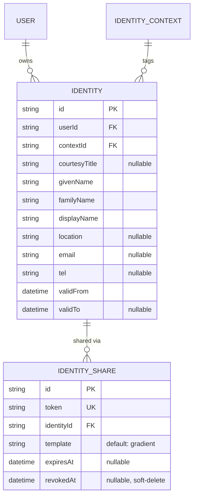
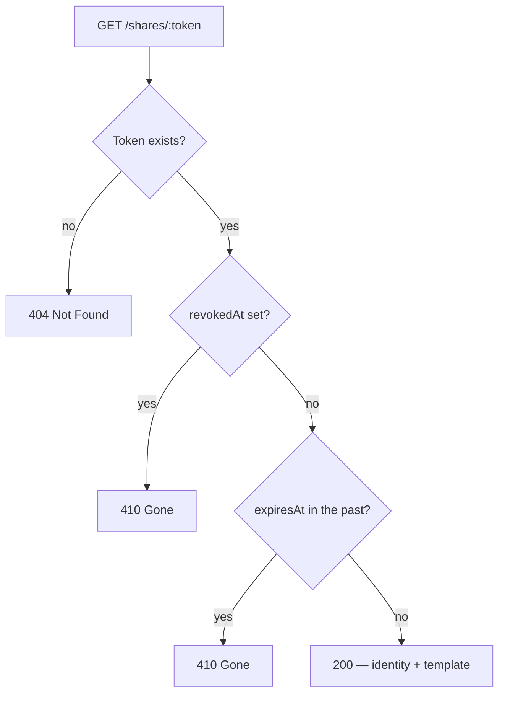
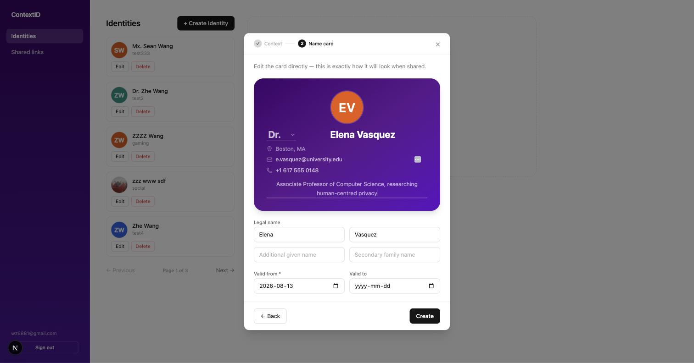
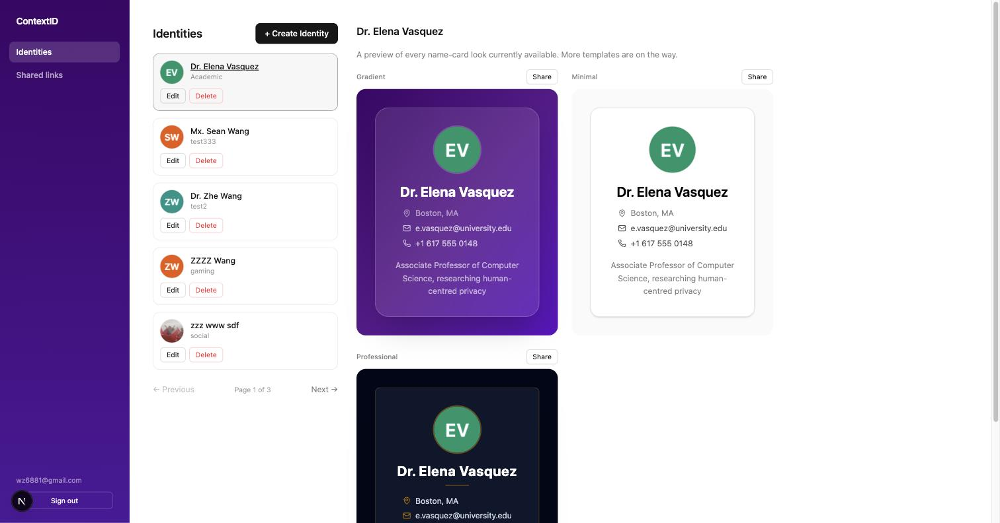
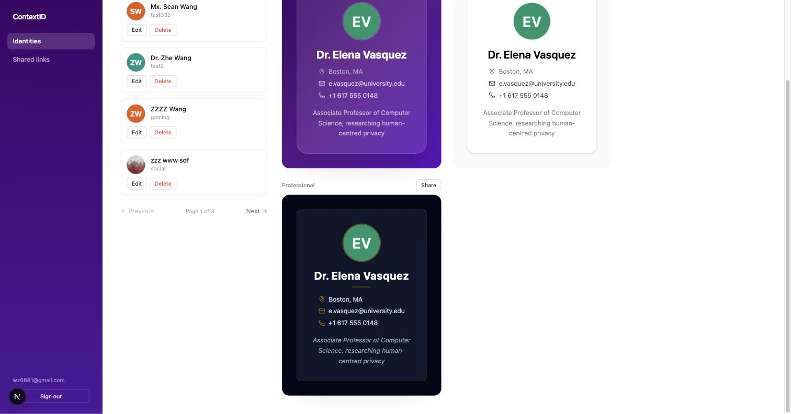
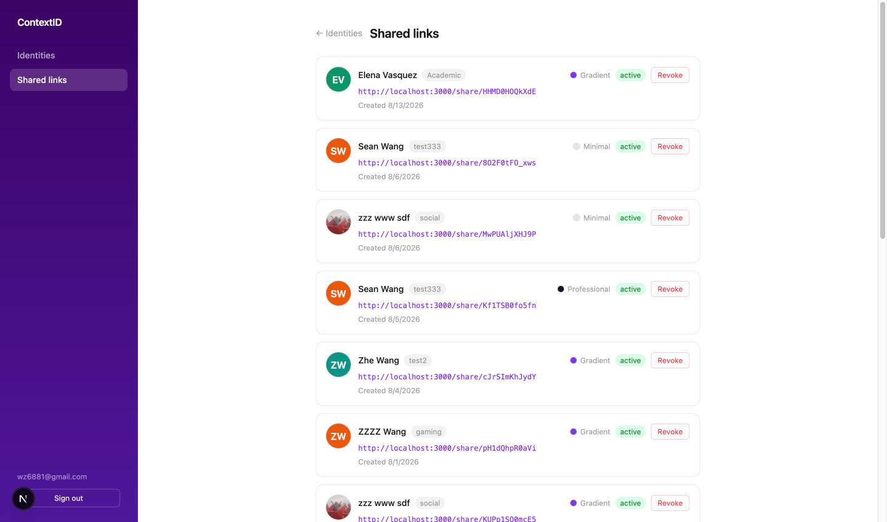

# CM3070 Final Project — Draft Final Report
## ContextID: A Context-Aware Digital Identity Management System

**Student:** Zhe Wang
**Date:** August 2026
**Template:** CM3035 Advanced Web Development — *Identity and profile management API*

---

# Chapter 1: Introduction

## 1.1 Motivation and Problem Statement

People have many roles at the same time: a software engineer, a musician, a parent, or a graduate of a certain university. In real life, this mix is normal. A person can show a different side of themselves at a conference than at a family dinner, without needing to connect the two. Online, very few platforms keep these parts separate. LinkedIn puts work history and education on one page; Facebook mixes friends and coworkers in the same feed; a single email address can quietly connect accounts that a person may have wanted to keep separate.

The results are real and easy to see. Someone at a conference may want to share contact details without giving out their personal phone number. A person with both a Chinese and an English name may find that one “full name” field cannot show their name correctly in both languages. Someone who shares their phone number with a new contact may later want to limit or remove that access — but find that most systems have no way to do this once the information has been shared. These are not rare cases; they are a normal part of online life for people who move between different social or work groups. Existing tools — LinkedIn, digital business cards, and personal profile pages — each solve part of the problem, but none combine separate contexts, detailed sharing controls, and the ability to take back access in one system designed for normal, non-technical users.

## 1.2 Project Concept

ContextID is a web-based identity management platform based on a simple idea: one user account can have several identity cards, each for a different context, such as Professional, Academic, Personal, Family, or a custom label. Each card has its own structured name, including given name, family name, optional additional given names, and secondary family names. This allows different naming styles to be represented correctly instead of forcing everyone into a simple two-field format. A card can also include a display name, optional title, email, phone number, location, short description, optional photo, and a validity period. This lets an identity or affiliation expire naturally instead of staying visible when it is no longer valid.

The main feature is sharing. An identity is not copied and pasted into an email or chat. Instead, it is shared through a link. The owner chooses a visual name-card design and creates a unique URL for that specific card. The recipient can open the link and see a clean public page without needing an account. The owner can revoke the link at any time from a dashboard that shows all links that have been created, whether they are still active or not. This gives the owner clear control over each piece of information they share, instead of sharing one complete profile with everyone.

The system is designed for people with little or no technical knowledge. Creating an identity is a simple guided process: choose a context, then edit the card directly while seeing what the recipient will see. Sharing a card takes one click, and the link is copied automatically. There is also no password to remember. Users can sign in with Google, GitHub, or a one-time email link.

## 1.3 Project Template

This project follows the **CM3035 Advanced Web Development** template, specifically the *Identity and profile management API* brief. That brief asks for a web application, built around a REST API, that lets users manage identity and profile data and control precisely how it is exposed to others. ContextID satisfies this with a full-stack implementation: a Fastify REST API in front of a PostgreSQL database (accessed through Prisma), fronted by a Next.js client that consumes it, with the deployment, requirements analysis, and evaluation work that the template expects of a working prototype rather than a literature-only project.

## 1.4 Technical Approach

The system is built as a TypeScript monorepo using Turborepo and pnpm. It has a Next.js 16 frontend with the App Router and a Fastify v5 REST API. Both applications use the same PostgreSQL database through a shared Prisma schema and client. Profile photos are stored in Amazon S3.

User login is handled by Auth.js v5, with support for Google OAuth, GitHub OAuth, and passwordless email login through Resend. User sessions are stored in the database instead of relying only on a signed cookie.

Deployment is automated with GitHub Actions and Terraform. When a release is tagged, Docker images for both applications are built and pushed to Amazon ECR. Database migrations are then applied, and the services are deployed to AWS ECS. GitHub OIDC is used for AWS access, so no long-term AWS credentials need to be stored in the repository.

The database continues to use an existing managed Aiven PostgreSQL instance instead of creating a new Amazon RDS instance. This keeps the setup simpler, as discussed further in Chapter 3.

## 1.5 Target Users and Value Proposition

ContextID is designed for professionals, academics, multilingual users, and anyone who often shares contact information but does not want to give everyone the same permanent profile. Its main value is contextual and revocable sharing: users decide what information to show, how it looks, who can see it, and how long it remains available. They can also change or cancel that access later.

A printed business card is a one-time action that cannot be undone. With ContextID, an identity card stays under the owner’s control for as long as it exists.

## 1.6 Report Structure

Chapter 2 reviews the literature that motivates and informs the design — personal names, contextual privacy, digital identity theory, and web API security — and evaluates ContextID against it critically. Chapter 3 sets out the requirements, architecture, and design decisions, updated from the preliminary report. Chapter 4 describes the implementation of the current system. Chapter 5 evaluates the project critically, including a security issue discovered and fixed during the writing of this report, and is honest about what remains undone. Chapter 6 concludes and sets out the remaining work.

---

# Chapter 2: Literature Review

## 2.1 Context Collapse and Contextual Integrity

The problem ContextID tries to solve is known in academic research as context collapse. Marwick and boyd (2011) used this term to describe what happens when a social platform brings together different audiences that people would normally keep separate — coworkers, family, and casual friends — into one shared space. Their study of Twitter users found that people often respond by either limiting what they say to what is safe for everyone, or by creating an “imagined audience” and hoping the real audience is similar. Neither approach works well when sharing a name instead of a post. A name cannot be changed or made more general in the same way as a sentence, so a platform that only supports one version of a person’s identity creates context collapse by design, not just through careless use.

Nissenbaum’s (2004) theory of contextual integrity provides a more detailed way to understand the problem. She argues that privacy is not simply about keeping information secret or controlling data. Instead, privacy depends on whether information is shared in ways that match the normal rules of a particular context. For example, sharing a professional affiliation at a conference and showing the same information on a dating profile uses the same data, but the two situations involve different and potentially inappropriate information flows. This point is important: contextual integrity can be broken by an inappropriate flow of information, not only by unauthorised access. ContextID follows this idea by using separate identity cards for different contexts instead of having one profile with visibility settings added later. The context is therefore defined when the identity is created and shared.

It is also important to be clear about what this design can and cannot do. Nissenbaum’s theory focuses on whether information flows are appropriate for a context, not on controlling what someone does with information after receiving it. ContextID provides technical controls such as hard-to-guess links, revocation, and expiration, but it cannot stop someone from sharing a card with other people or outside its intended context. Revoking a link only stops future access through that link. It cannot remove a screenshot or a copy that someone has already saved. This is a real limitation of the system, not a problem that has been fully solved, and it is discussed again in the evaluation.

## 2.2 Personal Names Are More Structured Than Software Assumes

Most software still stores a name as two fields, first and last. Ishida's (2011) W3C Internationalization guidance on personal names documents at length how poorly this generalises: in China, Japan, Korea, and Hungary the family name conventionally precedes the given name; Spanish and Portuguese names typically carry two family names, one inherited from each parent; Icelandic names have no family name in the Western sense at all; and automated parsing of a three-token name cannot reliably determine, without cultural context, whether it represents two given names and one family name or the reverse. Ishida's central methodological point — that name fields should be designed around what a form needs to *display and address a person correctly*, not around a fixed Western template — is the one ContextID adopts directly, storing given name, family name, and optional additional given and secondary family name components separately, together with a distinct, freely editable display name per identity.

This separation matters beyond formatting. ISO/IEC 24760-1:2019, the identity management terminology standard, defines an identity as a set of attributes related to an entity *within a particular context*, explicitly allowing the same entity to hold multiple, simultaneously valid identities. Read alongside Ishida, this supports treating the display name as a first-class, context-specific attribute rather than a derived string: a person's legal name is invariant, but the name they wish to be *addressed by* is not, and conflating the two — as most systems do — is itself a design error, not just an internationalisation gap.

## 2.3 Digital Identity Theory: Cameron's Laws of Identity

Cameron’s (2005) Laws of Identity, written while he was Microsoft’s Chief Identity Architect, is one of the best-known attempts to describe what a trustworthy digital identity system should do. Two of the seven laws are especially relevant to ContextID’s design and are worth comparing with the system rather than simply mentioning them.

The Law of Minimal Disclosure says that a system should share the smallest amount of identifying information needed for a specific purpose, and only for as long as needed. ContextID only partly follows this rule. A share link is limited to one identity card instead of the user’s entire account, which is a clear improvement over a single large profile. However, the card itself is shared as one complete unit. If a recipient only needs an email address, they also receive the phone number, location, and description because ContextID does not currently support sharing individual fields separately.

The Law of Directed Identity separates omnidirectional identifiers, which are public and easy to discover, such as a company’s DNS name, from unidirectional identifiers, which are intended for one specific party and should not be easily linked across different contexts. ContextID’s share tokens are designed to work as unidirectional identifiers. Each token is created separately for each recipient and is not based on the identity’s main database ID. As a result, two recipients with different links for the same identity card cannot use the tokens themselves to determine that the links belong to the same person. This is a real, although limited, match with Cameron’s model and provides stronger privacy than many consumer sharing tools.

## 2.4 Prior Art and the Gap

Several existing tools address fragments of the same problem. LinkedIn presents a single professional identity with no mechanism for showing a different profile to different viewers. Virtual business card applications such as HiHello and Blinq support sharing a card via a link but, in their free tiers, offer only one card per account and no link-level revocation once sent. Link-in-bio tools such as Linktree and About.me aggregate a single public identity rather than supporting multiple, separately controlled ones. None of the four combine multiple context-scoped identities, individually revocable and expirable share links, structured (non-Western) name fields, and zero-account access for the recipient.

| Tool | Multiple contexts | Access control | Link revocation | No recipient account | Structured names |
|---|:---:|:---:|:---:|:---:|:---:|
| LinkedIn | No | Coarse | No | No | No |
| HiHello / Blinq | Partial | No | No | Yes | No |
| About.me / Linktree | No | No | No | Yes | No |
| **ContextID** | **Yes** | **Yes** | **Yes** | **Yes** | **Yes** |

This comparison should not be read as ContextID being unambiguously "better" — each competitor optimises for something ContextID does not attempt, such as Linktree's aggregation of many external links in one page, or LinkedIn's network effects. The claim is narrower: none of them are built around Nissenbaum's flow-appropriateness principle as a first-class design constraint, and ContextID is.

## 2.5 Privacy Regulation and Privacy by Design

The GDPR (Regulation (EU) 2016/679) gives people the right to have their personal data erased (Article 17) and requires privacy to be considered when systems are designed and by default (Article 25). These ideas were also discussed earlier in Cavoukian’s (2009) Privacy by Design framework, which argues that privacy should be built into a system’s architecture instead of added later as a policy. ContextID’s revocation feature follows this idea. A share is revoked by setting a revokedAt timestamp, rather than through a manual or policy-based process. This means the technical ability to remove access is built into the system from the moment a share is created.

However, this claim should be considered carefully. ContextID revocation only makes the link invalid — the public page can no longer be opened using that token. It cannot remove information that a recipient has already viewed, copied, or saved. This is the same limitation discussed in §2.1: both contextual integrity and GDPR erasure describe an ideal where shared information can be withdrawn, but no link-based sharing system can fully achieve this once the information has left the original system. ContextID’s main benefit is that it makes the technical process of removing access quick and simple. This is a real improvement over an emailed vCard or a printed business card, neither of which can be revoked. At the same time, the system should not claim that revocation can undo information that has already been copied.

## 2.6 REST APIs for Identity Management

Fielding’s (2000) dissertation introduced Representational State Transfer (REST) as a way to design web systems around resources with stable URLs, a small set of standard methods, and independent requests that contain all the information needed to process them. This approach fits an identity system well. Identities, contexts, and shares can each be treated as separate resources, with their own URLs and lifecycles. Because the system is stateless, a recipient can open a public share link without having used the system before or having an active session. This makes the public sharing model simpler than a session-based or RPC-style API.

HTTP content negotiation (MDN, 2024), using headers such as Accept-Language, could also allow a REST identity API to return a name in a specific language or writing system. ContextID does not support this yet, but it is planned as future work in Chapter 6.

## 2.7 Web API Security

A system that stores personal information and makes some of it public must treat access control as a key part of the design, not just a coding detail. The OWASP Application Security Verification Standard (OWASP, 2021) recommends at least 64 bits of entropy for security-sensitive tokens, such as session IDs and password-reset links, because shorter tokens can be guessed at scale. It also requires authorization to be checked again for every request that changes data, based on the actual resource being changed. This helps prevent broken object-level authorization, which OWASP lists as the most common API security risk.

ContextID’s share tokens use nine bytes of secure random data, giving them 72 bits of entropy and therefore exceeding the 64-bit baseline. The second requirement — checking authorization for each resource and each request — is more difficult. As discussed in Chapter 5, ContextID did not fully meet this requirement until a complete security review was done while preparing this report. The review found and fixed a real security gap. This shows why OWASP treats this check as an ongoing requirement rather than a one-time design decision: it is easy to implement correctly in one API route but accidentally leave out of another as the codebase grows.

## 2.8 Authentication and Session Management

Cameron's Law of Minimal Disclosure (§2.3) extends naturally to authentication itself: a system should not require credentials — a password — that it does not need to operate securely. ContextID follows OAuth's authorisation-code flow for Google and GitHub sign-in and a single-use, time-limited email link for magic-link sign-in, so that the application itself never receives, stores, or is capable of leaking a password, because none is ever created. This is consistent with the broader industry and academic trend, motivated in large part by the frequency of credential-stuffing attacks against reused passwords, away from long-lived shared secrets and toward delegated or possession-based authentication. Sessions are stored server-side and re-validated against the database on every request, rather than trusted from a signed token's claims alone, which bounds the usable lifetime of a stolen session token even if the token itself is not cryptographically broken.

## 2.9 Synthesis

Taken together, this research points to one main design principle, even though each source describes it in different terms: information should only be shared as widely, for as long, and with as many people as the context requires. Nissenbaum (2004) describes this as appropriate information flow, Cameron (2005) calls it minimal disclosure, and the GDPR addresses it through data minimisation and erasure. At a basic level, all three make the same argument, applied to social rules, identity system design, and law.

None of the consumer tools discussed in §2.4 appears to follow this principle across the whole system. ContextID starts with this idea at the data-model level rather than adding it later as a policy. It uses separate identities for different contexts, allows each share to be revoked independently, and uses separate tokens for each share.

However, the research also makes the limits of this approach clear. ContextID cannot remove information that a recipient has already seen, copied, or remembered. It also cannot currently share only part of an identity card; the field-level sharing discussed as future work in Chapter 6 has not yet been implemented. These are limitations of the current approach, rather than simple implementation mistakes, and they are discussed honestly in Chapter 5.

---

# Chapter 3: Design

## 3.1 Requirements

### Functional Requirements

| ID | Requirement |
|---|---|
| FR1 | A user can register and sign in using Google OAuth, GitHub OAuth, or an email magic link |
| FR2 | A user can create an identity card assigned to a named context |
| FR3 | System-provided contexts (Personal, Work, Family, Social) are pre-seeded and available to all users |
| FR4 | A user can create custom contexts in addition to system contexts |
| FR5 | Each identity stores an optional courtesy title, given name, family name, optional additional given name, optional secondary family name, display name, optional email, phone number, location, description, and a validity date range |
| FR6 | A user can upload a profile photograph per identity; a deterministic placeholder is shown otherwise |
| FR7 | A user can preview an identity in every available visual template before sharing it |
| FR8 | A user can generate a share link for any identity in any one template, with an optional expiry date |
| FR9 | A share link is revocable by the owner at any time and preserves an audit record after revocation |
| FR10 | An expired or revoked share link returns a distinguishable error (410 Gone) to the viewer |
| FR11 | The public share page renders the identity using the template selected at share time, and is accessible without authentication |
| FR12 | A user can update any field of an existing identity |
| FR13 | A user can delete an identity and all its associated shares |
| FR14 | No user can read, modify, share, or delete another user's identity, context, or share record through any API route |

FR14 is stated explicitly and separately in this revision of the requirements, in direct response to the ownership-check gap discovered and fixed during the evaluation described in Chapter 5; it was previously only an implicit consequence of FR1, which was not sufficient to guarantee it.

### Non-Functional Requirements

**Security:** every operation on a protected resource requires a valid authenticated session, and every operation on a *specific* resource requires that the resource's owner match the authenticated caller (FR14). Share tokens must provide at least the OWASP-recommended 64 bits of entropy. Uploaded images are validated for MIME type and size before storage.

**Internationalisation:** name fields accommodate non-Latin naming structures, including compound family names and multiple given names, following the guidance reviewed in §2.2.

**Usability:** identity creation and editing present a live, direct-manipulation preview of the shared card rather than a disconnected form, so that a user can see exactly what a recipient will see before it is shared.

**Accessibility:** pages target WCAG 2.1 Level AA; as reported honestly in Chapter 5, this has not yet been verified by either automated or manual audit and remains outstanding work.

## 3.2 System Architecture

ContextID remains structured as a pnpm monorepo managed by Turborepo:

```
CM3070-FINAL-PROJECT/
├── apps/
│   ├── web/          Next.js 16 (App Router) — port 3000
│   └── api/          Fastify v5 REST API — port 4000
└── packages/
    └── database/     Prisma schema, migrations, seed, shared Prisma client
```

The separation between the Next.js frontend and the Fastify API is unchanged from the preliminary design: server components read from the database directly through the shared Prisma client on the read path, while client-side mutations are routed through a catch-all proxy route handler (`/api/proxy/[...path]`) that reads the `HttpOnly` Auth.js session cookie server-side and re-issues the request to Fastify with the session token attached as a `Bearer` header. This keeps the browser's own JavaScript from ever being able to read the session token directly, and lets the Fastify API enforce authentication and ownership independently of whichever client happens to be calling it.

## 3.3 Data Model

The domain schema has grown from five tables to the same five, extended with fields added as the system matured:

- **User** — account record, managed by Auth.js
- **IdentityContext** — named context, nullable `userId` (null for system contexts). A unique constraint on `(userId, name)` prevents duplicate custom context names per user
- **Identity** — the identity card. Beyond the fields present at the preliminary report stage (structured name fields, image, email, description, validity range), the schema now also carries `courtesyTitle`, `location`, and `tel`, added as later migrations to give the name-card templates (§4.4) enough fields to read as a complete professional or academic card rather than a bare name and email address. This was a design judgement made ahead of the template work, not a finding from user testing — no formal usability evaluation has been run at this stage (§5.5). A unique constraint on `(userId, contextId)` still enforces one identity per context per user
- **IdentityShare** — share record. A `template` column (default `"gradient"`) was added so that a share link now carries not just *which* identity is shared but *which visual design* it should be rendered in, decoupling the owner's presentation choice from the recipient's view
- **Account / Session / Authenticator / VerificationToken** — Auth.js adapter tables, unchanged



## 3.4 Key Design Decisions

**Direct-manipulation identity editing.** The three-step wizard described in the prototype report — context, then a plain form of name fields, then a separate preview step — has been collapsed to two steps: choose a context, then edit the card itself directly, with every field (courtesy title, display name, location, email, phone, description) entered on the actual rendered card rather than on a form beside it. The legal name fields (given/family/additional/secondary), which exist for correctness and internationalisation rather than for what a recipient sees, are demoted to a plainer section below the card. This is a direct application of the usability principle in §3.1: the user should never have to imagine what they are creating.

**Per-share template selection, not a single shared design.** Rather than one fixed public page layout, three visually distinct templates (Gradient, Minimal, Professional) are available, and the template is chosen at the moment a share link is created and stored on the `IdentityShare` record itself, not on the identity. This means the same identity can be shared to one audience in a plain, formal design and to another in a more expressive one, without maintaining two separate identity records — a small but genuine extension of the contextual-separation principle from Chapter 2 into presentation, not just data.

**Master–detail navigation, replacing a flat list.** As the number of identities a test account accumulates grows, a single flat list with an inline preview per row becomes unwieldy. The dashboard is now a persistent-sidebar, paginated master list on the left with a detail panel on the right showing the selected identity's full template gallery — a more conventional and more scalable information architecture for a growing collection of records.

**Soft deletion of shares; one identity per context; validity periods as first-class attributes.** These three decisions, and their rationale, are unchanged from the preliminary report: a revoked share returns `410 Gone` rather than being deleted outright, so the distinction between "never existed" and "deliberately withdrawn" survives for both the recipient and the owner's audit trail; the database-level uniqueness constraint on `(userId, contextId)` treats identity management as a deliberate, curated activity; and `validFrom`/`validTo` make an identity's temporal scope a structural property rather than optional metadata, consistent with the ISO/IEC 24760-1 attribute model discussed in §2.2.

## 3.5 Infrastructure: Plan Versus What Was Built

The preliminary report proposed ECS Fargate behind an Application Load Balancer, AWS Amplify for the frontend, and a new Amazon RDS PostgreSQL instance, provisioned inside a custom VPC. What has actually been built and deployed, as encoded in Terraform, differs in three respects, each a deliberate simplification made once the operational cost of the original plan became clearer against the time available:

1. **Both applications deploy as `aws_ecs_express_gateway_service` resources**, AWS's managed ECS "Express" gateway service type, rather than Fargate services fronted by a hand-configured ALB for the API and a separate Amplify build pipeline for the frontend. This halves the number of distinct deployment mechanisms to operate and monitor, at the cost of somewhat less configuration control than a bespoke ALB setup would offer.
2. **The account's default VPC and default subnets are used**, rather than a custom-provisioned VPC. This is a reasonable simplification for a project of this scale, though it is a genuine trade-off against network isolation that would matter more in a production multi-tenant deployment.
3. **The database remains the existing Aiven-managed PostgreSQL instance** used throughout development, rather than a newly provisioned Amazon RDS instance. Migrating a live database with real accumulated development data to a new provider mid-project carries migration risk with no functional benefit, so this was deferred rather than treated as a hard requirement.

Deployment itself is triggered by pushing a `v*.*.*` tag, not automatically on every push to `main` as the preliminary report described (that description was aspirational at the time of writing and did not reflect a workflow that had actually been built). The GitHub Actions job builds and pushes Docker images for both applications to ECR, applies pending Prisma migrations against the production database via a one-off task, and then deploys the API before the web service — deliberately ordered so that the frontend is never live against an API that has not yet received a migration it depends on. Authentication to AWS uses GitHub's OIDC federation, so no long-lived AWS access keys are stored as repository secrets. Chapter 5 evaluates what this pipeline is still missing: principally, that nothing currently gates a pull request on lint, type-check, or test results before it can be merged to `main`.

## 3.6 Work Plan and Current Status

| Phase | Tasks | Status |
|---|---|---|
| Research & Design | Literature review, requirements, wireframes | Complete |
| First Prototype | Auth, identity CRUD, sharing, S3 upload | Complete (Week 7) |
| Core Development | Card templates, courtesy title/location/tel fields, master–detail UI, WYSIWYG editing | Complete |
| CI/CD & Infrastructure | GitHub Actions deploy pipeline, Terraform infrastructure, secrets management | Deploy pipeline live; PR-gated lint/test workflow not yet built (§5.4) |
| Testing & Evaluation | Security audit (complete, this report), unit/integration tests, usability study, accessibility audit | In progress — security audit complete; remainder scheduled before final submission |
| Documentation & Submission | Final report, prototype video, code cleanup | In progress |

Development has run ahead of the original plan on features (template-based sharing, courtesy titles, and the master–detail interface were not part of the original scope) and behind it on verification (automated testing and the usability study, both originally scheduled for Weeks 14–19, have not yet started). This trade-off, and the concrete plan for closing the gap, is the central subject of Chapter 5.

---

# Chapter 4: Implementation

## 4.1 Overview

The implemented system now includes all of the main features, along with two major improvements added after the initial prototype: a direct-edit, two-step identity editor that replaces the earlier three-step wizard, and a visual template system for each share that separates the identity data from how it is shown to each recipient.

This chapter focuses on the code and logic behind three main mechanisms: the ownership checks now used across the API, the lifecycle of share tokens, and the template selection and rendering process. The last of these is the most important technical addition since the original prototype report.

## 4.2 Ownership Verification (IDOR Protection)

Every route that reads, updates, deletes, or shares a specific resource must establish two separate facts before touching the database: that the caller is authenticated at all, and that the caller *owns the specific resource being addressed*. The first is handled once, centrally, by a Fastify `preHandler` hook (`apps/api/src/index.ts`) registered on every protected route group, which validates the session's Bearer token against the `Session` table and attaches the resulting `userId` to the request. The second cannot be centralised in the same way, because "ownership" means something different for each resource type — it must be checked against the specific row being acted on, inside each route handler:

```ts
// apps/api/src/routes/identities.ts — PATCH /identities/:id
const existing = await prisma.identity.findUnique({
  where: { id: request.params.id },
  select: { userId: true },
});

if (!existing) {
  return reply.status(404).send({ error: "Identity not found" });
}

if (existing.userId !== request.userId) {
  return reply.status(403).send({ error: "Forbidden" });
}
```

This pattern — fetch just the owner column, compare against `request.userId` (never against anything the client sent in the request body), reject before mutating — is applied identically across `GET`, `PATCH`, and `DELETE` on `/identities/:id`, `GET`/`PATCH`/`DELETE` on `/identity-contexts/:id`, and the list endpoints `/users/:id/identities` and `/users/:id/identity-contexts`, which now check that the requested `:id` matches the caller's own `userId` before returning anything. `POST /identities` was changed to take `userId` from `request.userId` rather than from the request body, closing off the possibility of a caller creating a record under someone else's account. Chapter 5 discusses in detail why this consistency did not exist until this stage of the project, and how the gap was found.

## 4.3 Share Tokens and the Three-State Resolution

Share tokens are generated with `randomBytes(9).toString("base64url")` — nine bytes of cryptographically secure randomness, 72 bits of entropy, above the 64-bit OWASP baseline discussed in §2.7. The public resolution endpoint evaluates a token through an ordered check, returning a distinct status for each outcome so that a recipient (and the owner's own audit trail) can distinguish "never existed" from "deliberately withdrawn":



This part of the system is unchanged in principle from the feature prototype; what has changed is what the 200 response now carries.

## 4.4 Per-Template Sharing

At the prototype stage, a share link rendered the identity on one fixed public page. The current implementation instead stores a **template identifier** on the `IdentityShare` record itself, chosen by the owner when the link is created, and the public page resolves and renders whichever template that specific link was created with:

```ts
// apps/api/src/routes/shares.ts
const VALID_TEMPLATES = new Set(["gradient", "minimal", "professional"]);
// ...
if (template !== undefined && !VALID_TEMPLATES.has(template)) {
  return reply.status(400).send({ error: "Invalid template" });
}
const share = await prisma.identityShare.create({
  data: { token: randomBytes(9).toString("base64url"), identityId: identity.id,
    expiresAt: expiresAt ? new Date(expiresAt) : undefined, ...(template && { template }) },
});
```

```ts
// apps/web/app/share/[token]/page.tsx
const templateId = isTemplateId(identity.template) ? identity.template : DEFAULT_TEMPLATE;
const { Component } = TEMPLATES[templateId];
return <Component identity={identity} />;
```

The three templates (`gradient`, `minimal`, `professional`) are defined once, in a single registry (`apps/web/components/name-card-templates/index.ts`), each exporting both a compact `Card` component (used in the owner-facing gallery) and a full-page `Template` component (used on the public share page) that render the same `NameCardIdentity` shape with different visual treatments. This registry is the single source of truth the frontend reads from; a small, currently hand-maintained duplication is that the API's `VALID_TEMPLATES` set must be kept in sync with the registry's keys by hand rather than importing them, since the API and web packages do not currently share a template-definitions module — a minor but real technical-debt item for the remaining development time.

The owner-facing side of this is the **template gallery** (`identity-template-gallery.tsx`), rendered in the detail panel of the master–detail dashboard: every template is shown side by side, each with its own independent `Share` button, so the owner can compare designs before choosing one, rather than sharing blind:

```tsx
// apps/web/components/identity-template-gallery.tsx (elided for brevity)
Object.entries(TEMPLATES).map(([id, { Card, label, pageClass }]) => (
  <div key={id} className="flex flex-col gap-2">
    <div className="flex items-center justify-between">
      <span>{label}</span>
      <ShareTemplateButton identityId={identity.id} templateId={id} />
    </div>
    <div className={`${pageClass} rounded-2xl p-8`}>
      <Card identity={identity} />
    </div>
  </div>
))
```

Clicking `Share` on a specific template calls `useShareIdentity`, which posts `{ template }` to `POST /identities/:id/shares`, copies the resulting URL to the clipboard, and falls back to a manual-copy text field if `navigator.clipboard` is blocked — the same graceful-degradation pattern used in the prototype's sharing flow, now generalised to work per-template rather than for a single link.

## 4.5 Direct-Manipulation Identity Editing

The three-step wizard from the feature prototype (context → plain name form → separate preview) is now two steps: choose a context, then edit the card that will actually be shared. Every visible field — courtesy title, display name, location, email, phone, description — is an inline-editable control positioned directly on a live rendering of the Gradient template; only the legal name fields, which exist for record-keeping rather than presentation, sit in a plainer form section beneath it. The display-name auto-fill behaviour from the prototype is preserved unchanged: the field is derived from given and family name until the user edits it directly, at which point a `displayNameTouched` flag permanently suppresses further auto-fill for that session, so a deliberate customisation (a nickname, a different script) is never silently overwritten.

## 4.6 Visual Representation

**Step 2 of the identity editor** — every field is edited directly on the card that will be shared, not on a separate form:



**Master–detail dashboard with the template gallery** — the left column is a paginated list of the signed-in user's identities behind the persistent sidebar; selecting one renders every available template for that identity in the right-hand panel, each with its own Share control:




**Shares dashboard** — every link ever created for the signed-in user, across all identities and templates, showing which template each link uses and its current status:



**Public share page** — the unauthenticated recipient's view, rendered in the template chosen at share time:


---

# Chapter 5: Evaluation

This chapter extends the evaluation begun in the feature-prototype report from a single vertical slice to the whole system as it currently stands, and is deliberately more critical than the prototype's evaluation was: it reports a genuine security vulnerability discovered and fixed while preparing this document, and is explicit about what has not yet been verified at all.

## 5.1 Functional Correctness

All functional requirements listed in §3.1 were exercised manually end-to-end against the running application: sign-in via each provider, identity creation and editing through the new two-step editor (§4.5), the full share lifecycle across all four reachable states (active → 200, expired → 410, revoked → 410, non-existent → 404), and rendering of a shared identity in each of the three templates. The screenshots in §4.6 were captured directly from the running system against its real development database, not from mocked data, using a purpose-built demo identity created through the actual UI flow shown in §4.5. This confirms the features work as designed under normal use; it does not, by itself, constitute regression protection, which is addressed critically in §5.3.

## 5.2 Security: An Ownership-Check Audit, a Real Finding, and a Fix

Both earlier reports claimed that "ownership checks on every write" made the system's IDOR (Insecure Direct Object Reference) protection impossible to bypass by calling the API directly. While preparing this report, that claim was checked systematically, route by route, against the actual code rather than re-asserted from memory — and it was found to be **only partially true**.

**What was found.** The `shares.ts` routes (create share, list shares, revoke share) correctly compared the resource's `userId` against `request.userId` on every handler, exactly as both prior reports described. The `identities.ts` and `identityContexts.ts` routes did not: `GET`, `PATCH`, and `DELETE` on `/identities/:id` and all of `/identity-contexts/:id` sat behind the global authentication `preHandler` — which proves the caller holds *a* valid session — but never checked that the caller owned *this specific* resource. Concretely, before the fix, any authenticated user could read, edit, or delete any other user's identity or context simply by supplying its `cuid` in the URL, and `POST /identities` trusted a `userId` field taken directly from the request body rather than from the authenticated session, so a caller could also create an identity attributed to an arbitrary other account. This is precisely the OWASP broken-object-level-authorization pattern discussed in §2.7, and it existed because the ownership check had been applied consistently to one route file (`shares.ts`) but not propagated to the others as the API grew — exactly the failure mode OWASP's per-request, per-resource requirement is designed to catch, and exactly the kind of regression an automated test suite (see §5.3) exists to prevent.

**Impact.** The practical severity was bounded by the fact that resource IDs are Prisma `cuid()` values, which are not sequentially guessable, so exploitation would have required a caller to already know or enumerate another user's identity ID from some other channel (a leaked share link's underlying identity ID is not exposed, but IDs do appear in this project's own server logs and, notably, in the terraform state and screenshot artefacts produced incidentally during development). The vulnerability was real and a genuine defect, not a theoretical one, but was not observed to have been exploited.

**The fix.** Ownership checks matching the pattern already used correctly in `shares.ts` (shown in §4.2) were added to every affected route: `GET`/`PATCH`/`DELETE /identities/:id`, `GET`/`PATCH`/`DELETE /identity-contexts/:id`, and the two `/users/:id/...` list endpoints, and `POST /identities` was changed to take `userId` from the authenticated session rather than the request body. The change was verified by re-running the API's TypeScript type-check (`pnpm --filter api check-types`), which passed cleanly, and by re-reading every affected handler against the same ownership-check pattern used in §4.2. This is a materially weaker form of verification than an automated regression test would provide, and that gap is itself the subject of §5.3.

**Token entropy**, unaffected by the above, was reverified analytically: `randomBytes(9)` yields 72 bits of entropy, exceeding OWASP's 64-bit minimum (§2.7); at a generous 10,000 requests/second, exhausting the 2⁷² token space remains computationally infeasible (order 10¹³ years), and no rate limiting exists on the public share endpoint as a defence-in-depth measure — this specific gap was already identified as a limitation in the prototype report and remains open.

## 5.3 The Central Gap: No Automated Tests, No CI Gate

This is the most significant limitation of the project as it stands, and it is the direct reason the vulnerability in §5.2 was not caught earlier: **there are no automated tests anywhere in the repository** — no unit tests, no integration tests, and no end-to-end tests — despite the preliminary report's Chapter 3 explicitly describing a CI workflow that runs Vitest unit tests on every pull request. That workflow was never built; the only GitHub Actions workflow in the repository (`deploy-prod.yml`) triggers on a version tag push and performs build, migrate, and deploy steps, with no lint, type-check, or test gate anywhere in the path from a pull request to `main`. This is stated plainly here rather than repeated from the earlier report, because it is a real and consequential gap, not a minor documentation slip: it means the ownership-check regression in §5.2 could persist in the codebase indefinitely with no automated signal, and it means any future change carries the same risk with nothing to catch it.

The remediation is concrete and is prioritised as the first item of remaining work: (1) a `test` task added to `turbo.json` and each package's `package.json`, backed by Vitest; (2) route-level tests for `identities.ts` and `identityContexts.ts` that assert a second authenticated user receives 403/404 rather than the resource, directly regression-testing the fix in §5.2; (3) a `ci.yml` workflow, distinct from the existing deploy workflow, triggered on every pull request and push to `main`, running `pnpm lint`, `pnpm check-types`, and the new test suite, so that a change cannot reach `main` without passing all three. None of this exists yet at the time of writing; it is scheduled as the immediate next phase of work, ahead of the usability study.

## 5.4 Infrastructure and Deployment: A Critical Look at the Deviation from Plan

§3.5 described three deliberate simplifications against the original infrastructure plan — a managed ECS gateway service instead of Fargate-plus-Amplify, the account's default VPC instead of a custom one, and the existing Aiven database instead of a new RDS instance. Evaluated critically rather than merely reported: this was the right call for a solo, time-boxed project, because it reduced the number of independently-configured AWS primitives from roughly six (VPC, subnets, ALB, target groups, ECS services, Amplify app) to two managed services, at a real but acceptable cost — the project no longer demonstrates hands-on custom VPC and load-balancer configuration, which was part of the original technical ambition described in the proposal. The tag-triggered (rather than main-triggered) deploy pipeline is a similarly deliberate and defensible choice — it prevents an unreviewed merge from deploying automatically — but it currently substitutes for a PR-gated CI check rather than complementing one, which is the gap identified in §5.3.

## 5.5 Usability

No formal usability study has been conducted; the preliminary report's plan for a five-to-eight participant think-aloud study, scheduled for the Testing & Evaluation phase, has not yet started and is honestly reported as not yet done rather than described in anticipation of results that do not exist. What follows instead is a critical developer walkthrough and heuristic evaluation (Nielsen's ten usability heuristics) of the current interface, which is a materially weaker form of evidence than a study with independent participants and should be read as such.

The move from a three-step wizard to a two-step, direct-manipulation editor (§4.5) is a genuine improvement against Nielsen's *match between system and the real world* and *visibility of system status* heuristics: a user edits the actual card, not an abstraction of it, and sees the effect of every keystroke immediately. One concrete usability defect was found during this walkthrough and is reported here rather than smoothed over: once a user has created one identity in each of the four system contexts, the context-selection step of the editor offers **only** the "New context" option, with no visual explanation of why the previously-available system contexts have disappeared — a user unfamiliar with the one-identity-per-context constraint (§3.4) is left to infer it. This is a real, observed usability gap, not a hypothetical one, and a one-line explanatory message on that step ("You already have an identity in every system context — create a custom one, or edit an existing identity") is a low-effort fix planned before final submission. The shares dashboard's clear visual distinction between active and inactive links, and the clipboard-copy-with-fallback pattern, both carried over from the prototype and function correctly.

## 5.6 Accessibility

The preliminary report set a target of WCAG 2.1 Level AA, "verified by automated and manual review." No such review — automated or manual — has in fact been carried out at any point in the project to date; this is stated here as a limitation rather than restated as a target already met. An automated pass (axe-core or a comparable tool) against the master–detail dashboard, the identity editor, and the public share page is scheduled ahead of final submission, alongside a manual keyboard-navigation check of the editor's inline-editable card fields, which are the interface's least conventional interactive elements and the most likely to have accessibility gaps.

## 5.7 Critical Evaluation Against Objectives

Weighed against the objectives set out in Chapter 3, the project has clearly succeeded at its central technical proposition: an identity can be created, presented in a choice of visual designs, and shared via a link that is genuinely and immediately revocable, and the API's core resources are now — following the fix in §5.2 — consistently protected against cross-user access at the database layer rather than only in the UI. The template system (§4.4) is a real extension beyond the original proposal's scope, not just a restatement of it, and demonstrates a level of technical ambition — a shared component registry driving both owner-facing preview and recipient-facing rendering from one source of truth — beyond what was originally planned.

Set against that, three gaps are serious enough that they, not new features, should be the priority for the remaining project time: the complete absence of automated tests and of a PR-gated CI check (§5.3), which is both a quality risk in itself and the direct reason a real vulnerability went unnoticed for as long as it did; the usability study and accessibility audit that were planned but not started (§5.5, §5.6); and the smaller, already-identified items carried over unresolved from the prototype report — no rate limiting on the public share endpoint, no client-side validation that `validTo` follows `validFrom`, and no expiry-notification email. None of these are architectural problems; all are addressable, scoped, and already sequenced as the next phase of work, which is the honest basis for the plan set out in Chapter 6.

---

# Chapter 6: Conclusion

## 6.1 Summary

ContextID set out to address a problem that is ordinary rather than exotic: that most digital platforms force a single, permanent identity onto people who naturally, and legitimately, present themselves differently across the different spheres of their life. The system delivered separates identity into distinct, context-scoped cards; makes sharing an act that is revocable and auditable rather than final; and, in this stage of the project, extended that proposition with a choice of visual presentation per share, decoupling *what* is disclosed from *how* it looks to a given recipient. Chapter 2 grounded this in Nissenbaum's contextual integrity and Cameron's Laws of Identity rather than treating "privacy" as a single undifferentiated goal, and Chapter 5 evaluated the resulting system against that grounding critically, not just descriptively — including reporting and fixing a real access-control defect discovered in the course of that evaluation.

## 6.2 Reflections

The most significant lesson of this stage of the project is not technical but procedural: a systematic, adversarial re-reading of one's own code, done deliberately rather than assumed to be unnecessary because "the pattern is used elsewhere in the file," found a genuine vulnerability that two prior rounds of self-reported evaluation had missed. That the fix was small once found is less important than the fact that finding it required treating a prior report's own security claims as something to re-verify against the code, not something to restate. The absence of any automated test suite at this stage of a project whose brief is explicitly about API security is the clearest single indicator of where effort was under-allocated relative to feature work, and is treated in Chapter 5 as the priority for the time remaining, ahead of new functionality.

More broadly, the project is a small illustration of a tension that recurs throughout the identity and privacy literature reviewed in Chapter 2: the gap between the *technical* mechanics of revocation — a token that stops resolving — and the *informational* reality that a recipient who has already viewed or copied a card retains it regardless. No link-based sharing system, this one included, closes that gap; what such a system can do, and what ContextID does do, is make the technical act of withdrawal immediate, free, and available by default, which is a meaningful improvement over the alternative — an emailed vCard or a printed card — even though it is not the complete solution the word "revocable" might suggest at first reading. Naming that limitation clearly, rather than implying the problem is solved, is itself part of the intellectual contribution of this stage of the report.

## 6.3 Future Work

Ordered by priority for the remaining project time, rather than by ambition:

1. **An automated test suite and a PR-gated CI workflow** (§5.3) — the highest priority, both to close the specific class of regression found in §5.2 and because the project's brief is explicitly about secure API design.
2. **A formal usability study and an accessibility audit** (§5.5, §5.6), both planned since the preliminary report and not yet begun.
3. **Field-level, rather than whole-card, disclosure** — allowing a share to include only the fields a specific recipient needs (an email but not a phone number, for instance), which would bring the system closer to Cameron's Law of Minimal Disclosure (§2.3) than the current all-or-nothing card model does.
4. **Rate limiting on the public share endpoint, expiry-notification emails, and client-side date validation** — smaller, already-scoped items carried over from the prototype report.
5. **Multi-language name rendering via HTTP content negotiation** (§2.6), using the `Accept-Language` header to select among alternate name representations where a user has provided more than one — presently designed for in the data model's separation of legal and display names, but not yet implemented.

## 6.4 Closing Statement

The system built so far demonstrates that contextual, revocable identity sharing is not merely a theoretical nicety but a buildable, usable feature of an ordinary web application, using standard tools and without imposing any special software or account requirement on the people receiving a shared identity. What remains is not a question of feasibility but of verification and polish: proving, through tests and independent usability evidence rather than developer assertion, that the system behaves as this report claims it does — which is exactly the work now prioritised for the remainder of the project.

---

# References

- Cameron, K. (2005) *The Laws of Identity*. Microsoft Corporation. Available at: https://www.identityblog.com/stories/2005/05/13/TheLawsOfIdentity.pdf
- Cavoukian, A. (2009) *Privacy by Design: The 7 Foundational Principles*. Information and Privacy Commissioner of Ontario, Canada.
- CM3035 Advanced Web Development. Course materials on secure account management and REST API design. University of London.
- Fielding, R.T. (2000) *Architectural Styles and the Design of Network-based Software Architectures*. PhD dissertation. University of California, Irvine. Available at: https://www.ics.uci.edu/~fielding/pubs/dissertation/top.htm
- Ishida, R. (2011) *Personal names around the world*. W3C Internationalization. Available at: https://www.w3.org/International/questions/qa-personal-names
- ISO/IEC 24760-1:2019. *Information technology — Security techniques — A framework for identity management — Part 1: Terminology and concepts*. International Organization for Standardization.
- Marwick, A.E. and boyd, d. (2011) 'I Tweet Honestly, I Tweet Passionately: Twitter Users, Context Collapse, and the Imagined Audience', *New Media & Society*, 13(1), pp. 114–133.
- MDN Web Docs (2024) *Content negotiation*. Mozilla. Available at: https://developer.mozilla.org/en-US/docs/Web/HTTP/Content_negotiation
- Nissenbaum, H. (2004) 'Privacy as Contextual Integrity', *Washington Law Review*, 79(1), pp. 119–157.
- OWASP Foundation (2021) *OWASP Application Security Verification Standard (ASVS) 4.0*. Available at: https://owasp.org/www-project-application-security-verification-standard/
- OWASP Foundation (2023) *OWASP API Security Top 10*. Available at: https://owasp.org/www-project-api-security/
- Regulation (EU) 2016/679 of the European Parliament and of the Council of 27 April 2016 (General Data Protection Regulation).
