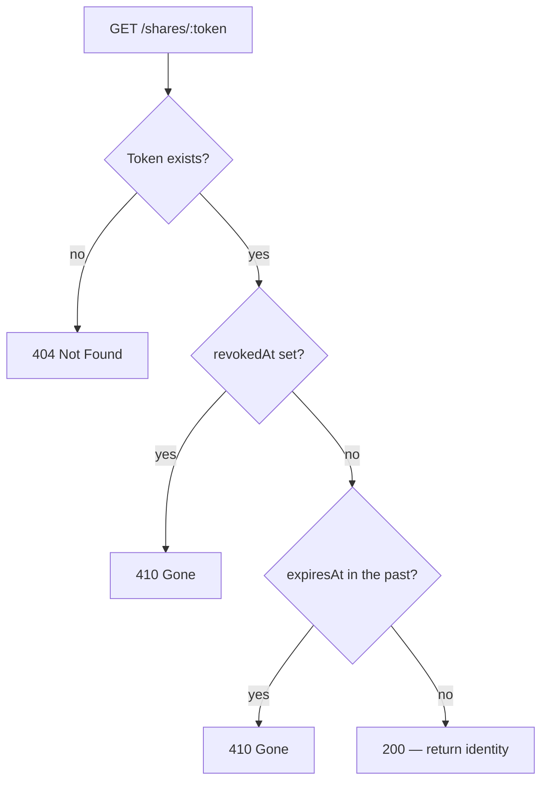
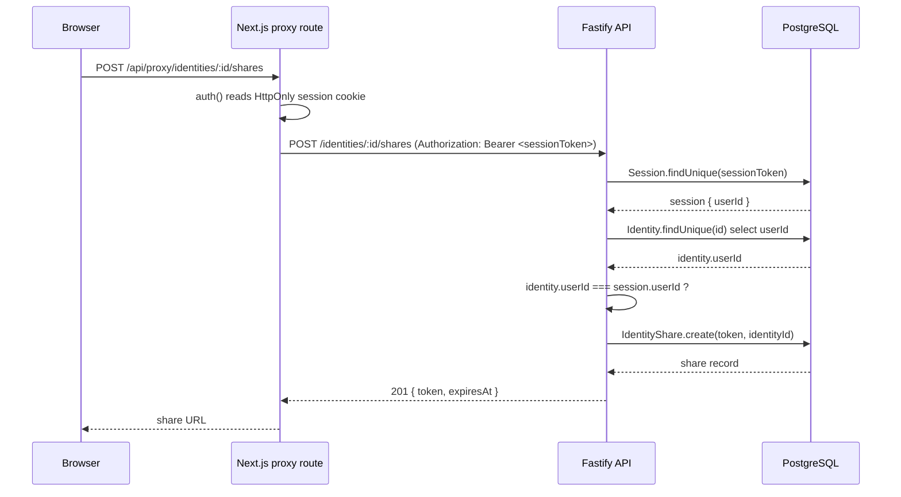
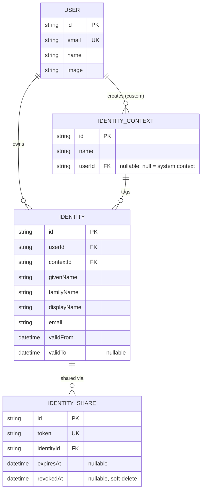
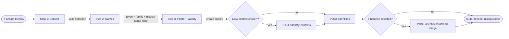
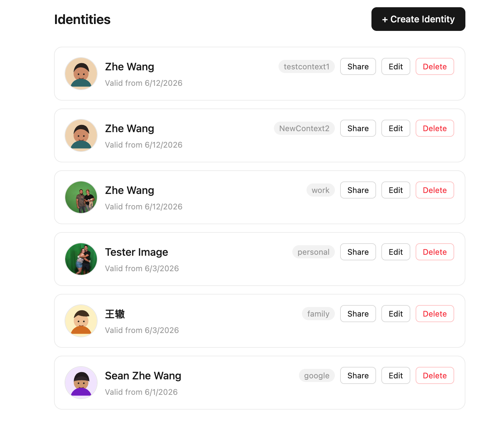
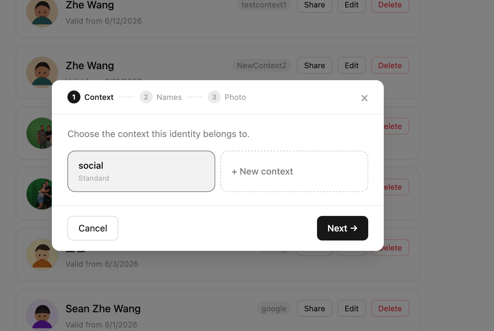
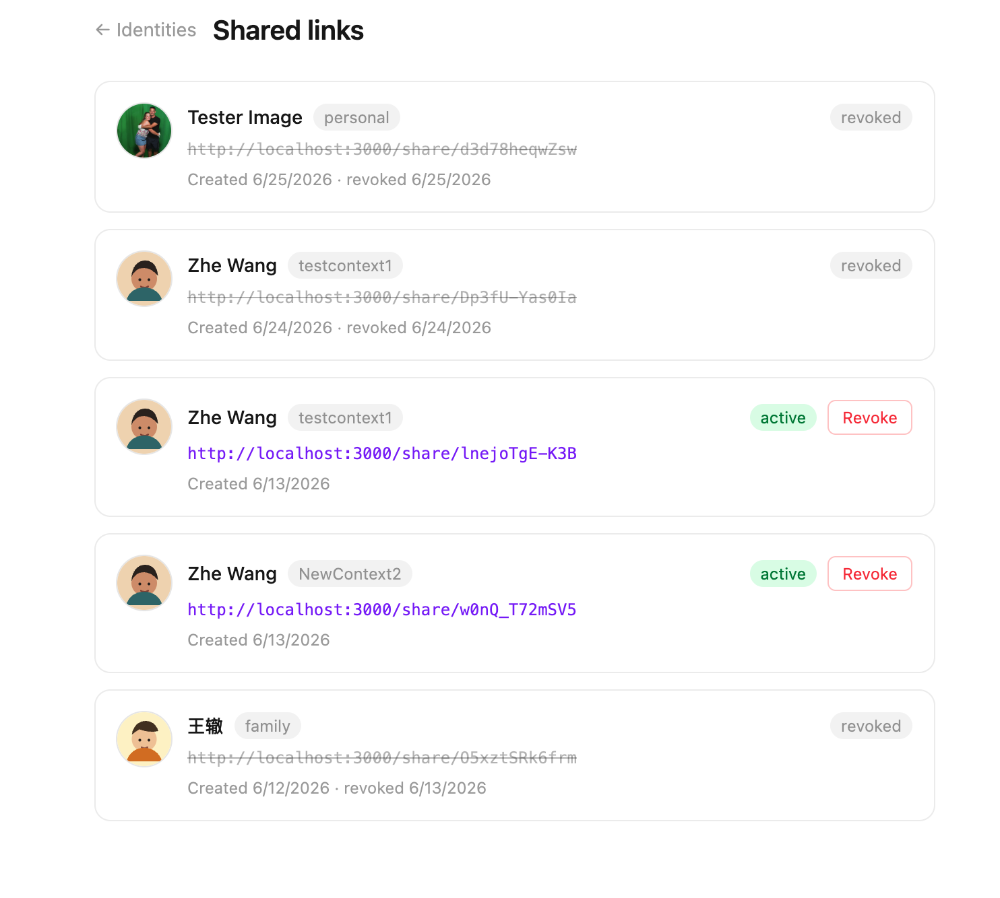
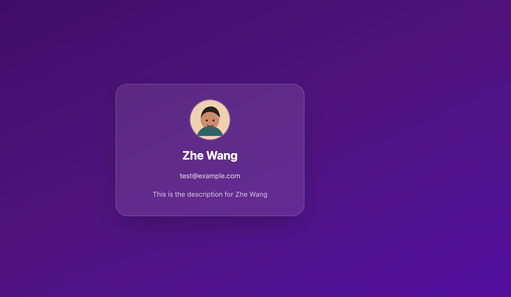

# Prototype Report — ContextID

**Student:** Zhe Wang
**Date:** July 2026
**Template:** CM3035 Advanced Web Development — *Identity and profile management API*

---

## 1. Template

This project follows the **CM3035 Advanced Web Development** template, specifically the *Identity and profile management API* brief. That brief calls for a web application built around a REST API that lets users manage identity/profile data and control how it is exposed to others. This prototype satisfies that brief with a full-stack implementation: a Fastify REST API fronting a PostgreSQL database, and a Next.js client that consumes it.

## 2. Project Overview

**ContextID** is a web-based identity management platform. Instead of one profile per person, a single user account holds several *identity cards*, each tagged with a context (Professional, Academic, Personal, Family, or a user-defined label). Each card stores its own name fields, contact email, description, photo, and a validity date range. The owner shares a card with someone else by generating a unique, revocable URL — the recipient views a clean public page with no account of their own.

The problem this solves: most platforms force one identity to serve every audience. LinkedIn mixes work and education; a single "full name" field can't represent someone who goes by a different name at work than at home, or whose name follows a non-Western structure; and once a phone number or email is shared, there is usually no way to take it back. ContextID's core proposition is *contextual, revocable disclosure* — the user decides what to show, to whom, and for how long.

### How this prototype fits into the project

The overall project plan runs in five phases: research and design, a first prototype, core development, CI/CD and infrastructure, and evaluation. This document describes the **first working prototype** (target: Week 7 of the project plan), which implements the full vertical slice of the core value proposition end-to-end — authentication, identity CRUD, contextual organisation, photo upload, and the complete share-link lifecycle. It intentionally does not yet cover later-phase work such as automated rate limiting, expiry notification emails, or the formal usability study, all of which are scheduled for the Core Development and Evaluation phases described in the project's preliminary report.

## 3. Features Implemented in This Prototype

- **Passwordless authentication** via Google OAuth, GitHub OAuth, or an email magic link (Auth.js v5, Resend).
- **Identity CRUD**, each identity attached to a context. Contexts are either system-provided (`personal`, `work`, `family`, `social`, seeded at setup) or created by the user on the fly.
- **Guided three-step creation wizard**: choose a context, enter structured name fields, then add a photo and validity dates.
- **Profile photo upload** to Amazon S3, validated by MIME type and size, with a deterministic placeholder illustration shown when no photo is set.
- **Share-link lifecycle**: generate a unique, optionally time-limited link for any identity; view it publicly with no login required; revoke it at any time from a shares dashboard that also shows past (expired/revoked) links.
- **Ownership enforcement** on every mutating request, independent of the UI.

## 4. Algorithms, Techniques and Methods

### 4.1 Ownership verification (IDOR protection)

Every route that reads or mutates a specific identity or share first fetches the resource's owning `userId` from the database and compares it against the authenticated caller's `userId` (attached to the request by the auth plugin). A mismatch returns `403` before any data is touched. This check is deliberately duplicated across each route handler rather than trusted to the UI, so it cannot be bypassed by calling the API directly.

### 4.2 Share token generation and entropy

Share tokens are produced with Node's `crypto.randomBytes(9)` — nine bytes of cryptographically secure random data — encoded with `base64url`. Nine bytes is 72 bits of entropy, above OWASP's recommended 64-bit minimum for unguessable tokens. At a generous attack rate of 10,000 requests/second, exhausting the 2⁷² token space would take roughly 1.49 × 10¹³ years, making enumeration attacks infeasible.

### 4.3 Three-state share resolution

The public share endpoint resolves a token through an ordered check, returning a distinct HTTP status for each outcome:



Using `410 Gone` (rather than `404`) for revoked or expired links is a deliberate semantic choice: it tells the recipient that access was *withdrawn*, distinct from a mistyped or never-existing URL — a distinction that also matters for the owner's audit trail.

### 4.4 Session-bearer proxy pattern

The browser never talks to the Fastify API directly for writes. Next.js route handlers under `/api/proxy/*` read the Auth.js session server-side (from an `HttpOnly` cookie the browser script cannot access), then re-issue the request to Fastify with the session token attached as a `Bearer` header. This lets one authentication mechanism (cookie-based, browser-facing) front a completely separate stateless API service (token-based, service-facing) without duplicating login logic.



### 4.5 Data model



`(userId, contextId)` is a unique constraint on `Identity`, so a user cannot accumulate two "Professional" cards by accident — updating an existing identity is the only way to change one. Revocation is a soft delete (`revokedAt` timestamp) rather than a row deletion, preserving the owner's audit history.

### 4.6 Wizard as a client-side state machine

The creation dialog is a three-step state machine gated by per-step validators (`canAdvanceStep1`, `canAdvanceStep2`); the "Next" button is disabled until the active step's required fields are valid.



Submission is a sequence of up to three API calls (context, identity, photo) rather than one transaction; each stage surfaces its own error inline without discarding the data entered so far, so a failure at, say, the photo-upload stage does not force the user to redo the earlier steps.

## 5. Code Explanation

### 5.1 Ownership check and token generation (`apps/api/src/routes/shares.ts`)

```ts
const identity = await prisma.identity.findUnique({
  where: { id: request.params.id },
  select: { id: true, userId: true },
});

if (!identity) {
  return reply.status(404).send({ error: "Identity not found" });
}

if (identity.userId !== request.userId) {
  return reply.status(403).send({ error: "Forbidden" });
}

const share = await prisma.identityShare.create({
  data: {
    token: randomBytes(9).toString("base64url"),
    identityId: identity.id,
    expiresAt: expiresAt ? new Date(expiresAt) : undefined,
  },
});
```

`request.userId` is populated by the `authenticate` plugin (§5.3), not by anything the client sends — a caller cannot forge ownership by editing a request body. The `select` clause only pulls `id` and `userId`, avoiding fetching the full identity record just to check ownership. The token itself is generated only after the check passes, so no random value is ever wasted on a forbidden request.

### 5.2 Public resolution endpoint (`apps/api/src/routes/shares.ts`)

```ts
const share = await prisma.identityShare.findUnique({
  where: { token: request.params.token },
  include: { identity: { include: { context: true } } },
});

if (!share) return reply.status(404).send({ error: "Share not found" });
if (share.revokedAt) return reply.status(410).send({ error: "Share has been revoked" });
if (share.expiresAt && share.expiresAt < new Date())
  return reply.status(410).send({ error: "Share has expired" });

return share.identity;
```

This route has no `authenticate` pre-handler — it is registered separately as `publicShareRoutes` — so it is reachable without a session, which is required for a recipient with no ContextID account. It returns `share.identity` only, never `share.identity.user` or any of the owner's other identities, keeping the disclosure scoped to exactly the one card that was shared.

### 5.3 Session authentication plugin (`apps/api/src/plugins/authenticate.ts`)

```ts
export async function authenticate(request: FastifyRequest, reply: FastifyReply) {
  const authHeader = request.headers.authorization;
  if (!authHeader?.startsWith("Bearer ")) {
    return reply.status(401).send({ error: "Unauthorized" });
  }
  const token = authHeader.slice(7);
  const session = await prisma.session.findUnique({ where: { sessionToken: token } });
  if (!session || session.expires < new Date()) {
    return reply.status(401).send({ error: "Unauthorized" });
  }
  request.userId = session.userId;
}
```

This plugin is what every protected route relies on for `request.userId`. It re-validates the session against the database on every request rather than trusting a signed token's claims alone — combined with the 5-minute session expiry configured in Auth.js, a stolen session token has a narrow window of use and can be invalidated server-side at any time.

### 5.4 Cookie-to-Bearer proxy (`apps/web/app/api/proxy/[...path]/route.ts`)

```ts
const session = await auth();
if (!session) return NextResponse.json({ error: "Unauthorized" }, { status: 401 });

const cookieStore = await cookies();
const sessionToken =
  cookieStore.get("authjs.session-token")?.value ??
  cookieStore.get("__Secure-authjs.session-token")?.value;

const upstreamHeaders = new Headers();
upstreamHeaders.set("Authorization", `Bearer ${sessionToken}`);
```

The session cookie is `HttpOnly`, so client-side JavaScript can never read it directly — this route handler reads it server-side and re-attaches it as a header the Fastify API understands. This is why the frontend's fetch calls (e.g. in the wizard, §5.5) can simply call `/api/proxy/identities` with no manual auth handling: the proxy transparently supplies it.

### 5.5 Auto-filling the display name (`apps/web/components/create-identity-dialog.tsx`)

```ts
function set(field: keyof NamesStep, value: string | boolean) {
  const next = { ...data, [field]: value };
  if ((field === "givenName" || field === "familyName") && !next.displayNameTouched) {
    next.displayName = [next.givenName, next.familyName].filter(Boolean).join(" ");
  }
  onChange(next);
}
```

`displayNameTouched` tracks whether the user has ever typed directly into the display-name field. Until they do, it is derived from given + family name as those fields are typed — useful for the common case, but the moment the user edits it manually (setting `displayNameTouched: true` in the field's own `onChange`), auto-fill stops, so a deliberate customisation (e.g. adding a nickname or a different script) is never silently overwritten.

## 6. Visual Representation

**Dashboard** — the authenticated user's identity list, one row per card, each showing its context tag and Share / Edit / Delete actions:



**Creation wizard, Step 1** — context selection, with the step indicator showing progress and the "New context" option available inline:



**Shares dashboard** — active links shown with a live URL and a Revoke action; expired/revoked links shown struck-through with no action available:



**Public share page** — the unauthenticated recipient's view of a shared identity, showing only that card's display name, photo, email, and description:



## 7. Evaluation

### 7.1 Functional correctness

All core flows were exercised manually end-to-end: sign-in via each of the three providers, creating an identity in a system and a custom context, uploading a photo, generating a share link, viewing it as an unauthenticated recipient, and revoking it. The share endpoint was tested against all four reachable states — active, expired, revoked, and non-existent — returning `200`, `410`, `410`, and `404` respectively, matching the design in §4.3. The screenshots above are taken from the running prototype against its real (Aiven-hosted) development database, not mocked data.

### 7.2 Security

Token entropy (72 bits) and the infeasibility of enumeration were verified analytically (§4.2). The ownership check (§5.1) sits in the database-access layer of every mutating route, not the UI, so it applies uniformly regardless of client. The `HttpOnly` cookie plus server-side proxy (§5.4) means a browser-side XSS payload cannot read the session token directly, though this is not a substitute for output sanitisation elsewhere in the app.

### 7.3 Usability

The wizard's step-gating (disabled "Next" until required fields are valid) and its partial-failure recovery (an error at any submission stage keeps the dialog open with prior input intact) were confirmed by walking through the flow, including deliberately triggering a validation error and a duplicate-context conflict. The shares dashboard's visual distinction between active (green pill, live monospace link) and inactive (grey pill, struck-through link) states is visible directly in the screenshot in §6.

### 7.4 Limitations and planned improvements

1. **Client-side date validation** — Step 3 does not yet enforce `validTo > validFrom` before submission; this currently surfaces as a preventable round-trip error from the API.
2. **Rate limiting** on `GET /shares/:token` is not implemented. Token entropy makes brute-force enumeration computationally infeasible, but per-IP rate limiting is still a defence-in-depth measure planned before any public deployment.
3. **Clipboard fallback UX** — when clipboard access is blocked, the share button falls back to a manual-copy input field; this works but is a rougher interaction than a one-click copy and could be smoothed with a visible toast/confirmation.
4. **Expiry notifications** — a user who sets an expiry date is not warned when it passes; a recipient will simply start receiving `410 Gone`. An email notification at expiry is planned for the Core Development phase.
5. **Formal usability testing** has not yet been run; the assessment above is developer walkthrough only. A 5–8 participant think-aloud study is scheduled for the project's Evaluation phase and will be used to revise the interface before final submission.

Overall, this prototype demonstrates that the core proposition — creating a context-specific identity and sharing it via a controlled, revocable URL — works end-to-end, is enforced correctly at the API layer against IDOR and token-guessing attacks, and is usable enough for a developer walkthrough to complete the full flow without confusion. The identified gaps are scoped, concrete, and already sequenced into the remaining project phases.
